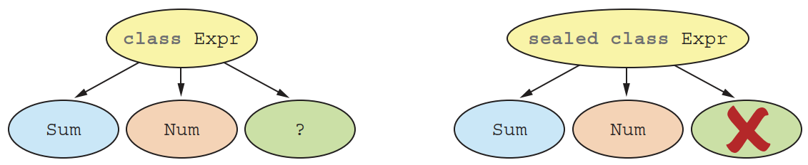
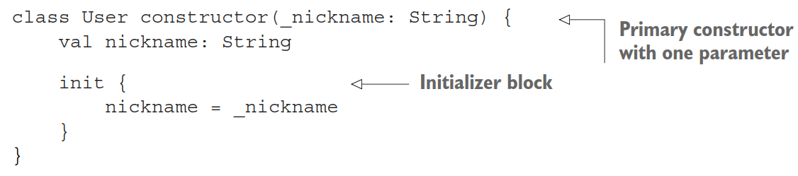

# 类、对象和接口

## 简介

Kotlin 的类与 Java 有些不同：

- Kotlin 的接口可以包含属性声明
- Kotlin 的声明默认为 `final` 和 `public`
- 嵌套类默认不是内部类，不包含对外部类的隐式引用

将类声明为 `data` 编译器会自动生成多个标准方法。

Kotlin 用 `object` 关键字声明类，以及创建类的实例。

## 定义类

下面介绍如何定义类层次结构，了解 Kotlin 的可见性、`sealed` 修饰符等。

### 接口

Kotlin 接口可以包含：

- 抽象方法的定义
- 非抽象方法的实现
- 不能包含状态

使用 `interface` 关键字声明接口。例如：

```kotlin
interface Clickable {
    fun click()
}
```

该接口只有一个名为 `click` 的抽象方法，不返回任何值。

> [!NOTE]
>
> 从技术上讲，该方法返回 `Unit`，相当于 Java 的 `void`。

**实现接口**

将接口名称放在类名称后面，从 `:` 分隔，表示实现接口：

```kotlin
class Button : Clickable {
    override fun click() = println("I was clicked")
}

fun main() {
    Button().click()
    // I was clicked
}
```

Kotlin 的合成（composition，即实现接口）和继承（inheritance）都使用冒号 `:`。一个类可以多个接口，但只能继承一个类。

`override` 修饰符用于标记覆盖超类或接口的方法与属性。与 Java 中 `@Override` 注释可选不同，Kotlin 中覆盖**必须**使用 `override` 修饰符。

接口方法可以有**默认实现**。例如，在 `Clickable` 接口添加了带默认实现的 `showOff` 函数：

```kotlin
interface Clickable {
    fun click() // 常规方法声明
    fun showOff() = println("I'm clickable!") // 带默认实现的方法
}
```

如果实现该接口，则必须提供 `click` 实现。`showOff()` 实现则是可选的。

现在，假设另一个接口也定义了 `showOff` 方法，并具有以下实现：

```kotlin
interface Focusable {
    fun setFocus(b: Boolean) =
        println("I ${if (b) "got" else "lost"} focus.")

    fun showOff() = println("I'm focusable!")
}
```

现在你有一个类需要同时实现这两个接口，它们都包含带默认实现的 `showOff` 方法，那么会使用哪个实现？此时编译器会报错，要求你必须提供自定义实现：

```kotlin
class Button : Clickable, Focusable {
    override fun click() = println("I was clicked")

    override fun showOff() {
        super<Clickable>.showOff()
        super<Focusable>.showOff()
    }
}
```

`Button` 类实现了两个接口，通过调用超类实现 `showOff()`。这里使用 `super` 关键字加基础类型一起 `super<Clickable>.showOff()` 调用超类方法，与 Java 中 `Clickable.super.showOff()` 有所不同。

如果只需要调用一个继承的实现，则可以使用表达式语法：

```kotlin
override fun showOff() = super<Clickable>.showOff()
```

功能展示：

```kotlin
fun main() {
    val button = Button()
    button.showOff()
    //    I'm clickable!
    //    I'm focusable!
    button.setFocus(true)
    // I got focus.
    button.click()
    // I was clicked
}
```

对带默认方法的接口，Kotlin 将其编译为常规接口和包含 static 方法的类。接口只包含声明，所有默认实现以 static 方法形式放在类中。因此，如果需要在 Java 类中实现这样的忌口，就必须为所有方法定义自己的实现，包括那些在 Kotlin 中带默认实现的方法。例如，实现 `Clickable` 的 `JavaButton` 需要提供 `click` 和 `showOff` 的实现，尽管 Kotlin 提供了 `showOff` 的默认实现。如下：

```java
class JavaButton implements Clickable {
    @Override
    public void click() {
    	System.out.println("I was clicked");
    }

    @Override
    public void showOff() { // Java 代码无法使用 Kotlin 的默认实现
    	System.out.println("I'm showing off");
    }
}
```

### open, final 和 abstract

Kotlin 默认不允许继承或覆盖基类中的任何方法。Kotlin 中所有类和方法和属性默认为 `final`。这与 Java 相反。

标记为 `open` 的类才允许继承。同理，标记为 `open` 的方法或属性才能被覆盖。

例如，你有一个 `RichButton` 类：

```kotlin
open class RichButton : Clickable { // open 类，可以继承
    fun disable() { /* ... */ } // 默认 final，不能在子类中重写
    open fun animate() { /* ... */ }  // open 方法，可以在子类重写
    override fun click() { /* ... */ } // 重写的 open 函数，也是 open
}
```

`RichButton` 的子类可能如下：

```kotlin
class ThemedButton : RichButton() { // diable 为 final，因此这里无法重写
    override fun animate() { /* ... */ } // animate 为显式 open，可以重写
    override fun click() { /* ... */ } // 可以重写 click
    									//因为 RichButton 没有显式将其标记为 final
    override fun showOff() { /* ... */ } // 可以重写 showOff
    									// 即使 RichButton 没有提供一个 override
}
```

> [!NOTE]
>
> 重写的基类或接口中的成员默认为 `open`。当然也可以显式标记为 `final` 。
>
> ```kotlin
> open class RichButton : Clickable {
> 	final override fun click() { /* ... */ } // 这里 final 不多余
>     										// 因为 override 隐式 open
> }
> ```

> [!TIP]
>
>  默认 `final` 使得智能 cast 应用场景更多。因为编译器只能对类型检查后无法更改的变量执行只能转换。
>
> 对类而言，意味着智能 cast 只能用于 `val` 属性，且没有自定义 accessor。这意味着该属性必须为 `final`，否则子类可能覆盖该属性并定义自定义 accessor，从而破坏智能 cast 的要求。
>
> 由于属性默认为 `final`，因此对大多数属性可以使用智能 cast，提高了代码的表达能力。

**abstract**

声明为 `abstract` 的类无法实例化。抽象类通常包含没有实现的抽象成员，必须在子类中 override。抽象成员总是 open，不需要显式添加 `open` 修饰符（与接口一样）。

示例

```kotlin
abstract class Animated { // abstract 类，无法创建其实例
    // abstract 属性，没有值，子类需 override 其值或 accessor
    abstract val animationSpeed: Double
    // abstract 类中的属性，默认非 open，但可以显式标记为 open
    val keyframes: Int = 20 
    open val frames: Int = 60
	
    // abstract 函数，没有实现，子类必须 override
    abstract fun animate()
    // abstract 类中的非 abstract 函数，默认非 open，但可以标记为 open
    open fun stopAnimating() { /* ... */ } 
    fun animateTwice() { /* ... */ }
}
```

下表列出了 Kotlin 中的访问修饰符。表中的说明适用于类；对接口，不需要使用 `final`, `open` 和 `abstract`。接口中的成员总是 `open`，不能声明为 `final`；如果接口成员没有默认实现，则实际为 `abstract`，但不需要添加 `abstract` 关键字。

| 修饰符   | 成员                   | 说明                                        |
| -------- | ---------------------- | ------------------------------------------- |
| final    | 不能覆盖               | 默认用于类成员                              |
| open     | 可以覆盖               | 必须显式指定                                |
| abstract | 必须覆盖               | 只能用于 abstract 类；abstract 成员没有实现 |
| override | 覆盖接口或超类中的成员 | 覆盖成员默认 open，除非显式标记为 `final`   |

控制继承的所有修饰符就讨论完了。

### 可见性修饰符：默认 public

Kotlin 提供 `public`, `protected` 和 `private` 修饰符，与 Java 类似：

- `public` 对所有可见
- `protected` 对子类可见
- `private` 对类内部可见；或者在顶层声明中，在文件内部可见

为了限制模块内部的可见性，Kotlin 提供了 `internal` 修饰符。

> [!NOTE]
>
> 使用 Gradle 时，`test` 源码可以访问声明为 `internal` 的 `main` 中的源码。
>
> Java 中默认为 package 可见，Kotlin 没有 package 可见的概念。Kotlin 只将 package用于组织代码，而不用于控制可见性。`internal` 可见性为模块的实现细节提供了封装。在 Java 中很容易破坏封装，因为外部代码可以在相同 package 中定义类，从而获得 package 可见性。

| 修饰符        | 类成员     | 顶层声明   |
| ------------- | ---------- | ---------- |
| public (默认) | 全部可见   | 全部可见   |
| internal      | 模块内可见 | 模块内可见 |
| protected     | 子类可见   | -          |
| private       | 类内部可见 | 文件内可见 |

**示例**：编译错误

```kotlin
internal open class TalkativeButton { 
    private fun yell() = println("Hey!")
    protected fun whisper() = println("Let's talk!")
}

fun TalkativeButton.giveSpeech() { // Error: giveSpeech 的接受类型
    								// TalkativeButton 为 internal
    yell() // Error: yell 为 private

    whisper() // Error: whisper 为 protected
}
```

`giveSpeech()` 为 `public`，不能引用 `internal` 的 `TalkativeButton`。

**规则**：类的基础类型、类和方法的类型参数的可见性不能低于类或方法本身。

基于该规则，上面编译错误，可以通过将 `giveSpeech()` 声明为 `internal`，或者将 `TalkativeButton` 声明为 `public` 来解决。

> [!NOTE]
>
> 在 Java 中，可以访问相同 package 中的 `protected` 成员，但 Kotlin 不允许。
>
> Kotlin 中类的扩展函数无法访问类的 `private` 和 `protected` 成员。
>
> Kotlin 编译成 Java 字节码时保留 `public`, `protected` 和 `private` 修饰符，与 Java 一致。但 `private` 例外，被转换为 package-private，因为 java 不能将类声明为 `private`。
>
> `internal` 修饰符在 Java 字节码中被转换为 `public`。所以，用 Kotlin 编写的代码，有时候不能在 Kotlin 中调用，但是在 Java 中就可以访问。但是，类的 `internal` 成员的名字被打乱了。所以，从技术上讲，`internal` 成员可以在 Java 使用，但 Java 代码很丑。

### 内部和嵌套类

与 Java 不同，Kotlin 中的嵌套类默认不能访问外部类实例。例如：

```kotlin
interface State : Serializable

interface View {
    fun getCurrentState(): State
    fun restoreState(state: State) { /* ... */}
}
```

然后在 `Button` 类内部定义一个 `ButtonState` 用于保存 button 的状态。在 Java 中，可以按以下方式定义：

```java
/* Java */
public class Button implements View {
    @Override
    public State getCurrentState() {
        return new ButtonState();
    }

    @Override
    public void restoreState(State state) { /*...*/ }

    public class ButtonState implements State { /*...*/ }
}
```

该代码会抛出 `java.io.NotSerializableException: Button` 异常，因为在 Java 中，当在一个类中声明另一个类，它默认变为内部类。`ButtonState` 类隐私存储对外部类 `Button` 的引用。由于 `Button` 不能序列化，那么 `ButtonState` 自然不能序列化，即 `ButtonState` 持有 `Button` 的应用破坏了其序列化性质。

解决方法是将 `ButtonState` 声明为 `static`。将嵌套类声明为 `static` 会移除对外部类的隐式引用。

在 Kotlin 中，内部类的行为与 Java 相反。如下：

```kotlin
class Button : View {
    override fun getCurrentState(): State = ButtonState()

    override fun restoreState(state: State) { /*...*/ }

    class ButtonState : State { /*...*/ } // 等效于 Java 中 static 嵌套类
}
```

Kotlin 中没有显式修饰符的嵌套类与 Java 中的 static 嵌套类相同。使用 `inner` 可以转换为内部类，从而持有外部类的引用。

| class B 内部声明 class A       | Java             | Kotlin          |
| ------------------------------ | ---------------- | --------------- |
| 嵌套类（不存储对外部类的引用） | `static class A` | `class A`       |
| 内部类（存储对外部类的应用）   | `class A`        | `inner class A` |

嵌套类与内部类的差别如下：嵌套类没有对外部类的引用，而内部类有。


Kotlin 中引用外部类实例的语法与 Java 也不同。在 `Inner` 类中通过 `this@Outer` 访问 `Outer` 类：

```kotlin
class Outer {
    inner class Inner {
    	fun getOuterReference(): Outer = this@Outer
    }
}
```

### Sealed 类

示例：

```kotlin
interface Expr
class Num(val value: Int) : Expr
class Sum(val left: Expr, val right: Expr) : Expr

fun eval(e: Expr): Int =
    when (e) {
        is Num -> e.value
        is Sum -> eval(e.right) + eval(e.left)
        else ->
            throw IllegalArgumentException("Unknown expression")
    }
```

这里使用 `when` 表达式，所以需要穷尽所有可能，上面用 `else` 处理其它情况。但是总添加一个 default 分支不方便，而且如果添加了一个新子类，编译器也不会提示缺失了某种可能。

Kotlin 提出了 `sealed` 类用于解决这类问题。`sealed` 标记的类限制了子类的可能性:

- 所有直接子类在编译时必须已知
- 在同一个 package 中声明
- 所有子类必须位于同一个 module

下面将 `Expr` 声明为 `sealed class`：

```kotlin
sealed class Expr // 基类声明为 sealed
class Num(val value: Int) : Expr()
class Sum(val left: Expr, val right: Expr) : Expr() // 列出所有子类

fun eval(e: Expr): Int =
    when (e) { // 覆盖所有可能，不需要 else 分支
        is Num -> e.value
        is Sum -> eval(e.right) + eval(e.left)
    }
```

声明为 `sealed` 意味着该类是 abstract，同时可以添加 abstract 成员。sealed 类的行为如下图：



> sealed 类的所有直接子类在编译时必须已知

如果 `when` 没有覆盖 `sealed` 类的所有子类，编译会出错。例如，添加一个 `Mul` ：

```kotlin
sealed class Expr
class Num(val value: Int) : Expr()
class Sum(val left: Expr, val right: Expr) : Expr() 
class Mul(val left: Expr, val right: Expr): Expr()

fun eval(e: Expr): Int =
    when (e) {
        is Num -> e.value
        is Sum -> eval(e.right) + eval(e.left)
        // ERROR: 'when’ expression must be exhaustive,
        // add necessary 'is Mul' branch or 'else' branch instead
    }
```

除了类，还可以用 `sealed` 修饰接口，规则相同：

```kotlin
sealed interface Toggleable {
	fun toggle() // sealed 接口定义函数和属性
}

class LightSwitch: Toggleable {
	override fun toggle() = println("Lights!")
}

class Camera: Toggleable {
	override fun toggle() = println("Camera!")
}
```

Kotlin 中扩展类或实现接口的语法：

```kotlin
class Num(val value: Int) : Expr() // 扩展类
class LightSwitch: Toggleable // 实现接口
```

这里 `Expr()` 的含义还未讨论。

## 构造函数与初始化

在面向对象语言中，一个类可以有多个构造函数，Kotlin 也不例外。但 Kotlin 区分主构造函数（primary）和次级构造函数（secondary）。primary 构造函数通常在类外部声明，而 secondary 构造函数则在类内部声明。

### 主构造函数

声明简单类：

```kotlin
class User(val nickname: String)
```

通常来说，一个类的所有声明都在大括号内部，这个简单类为何不同？

括号内的代码称为**主构造函数**（primary constructor）。主构造函数有两个目的：

1. 指定构造函数参数
2. 定义由这些参数初始化的属性

下面显式声明上述类：



这里有两个关键字：`constructor` 和 `init`。

`constructor` 声明主构造函数或次构造函数，`init` 关键字引入 initializer 代码。initializer 包含创建类执行的初始化代码，与主构造函数一起使用。由于主构造函数有语法限制，无法包含初始化代码，所有才有了 `init` 初始化代码块。如果需要，可以在一个类中声明多个初始化块。

对该示例，其实不需要将初始化代码放在 `init` 块中，可以与 `nickname` 属性声明合并。如果对主构造函数没有注释或可见修饰符，也可以省略 `constructor` 关键字。应用这些修改，得到：

```kotlin
class User(_nickname: String) { // 一个参数的主构造 函数
	val nickname = _nickname // 用参数初始化属性
}
```

这是声明相同类的另一种方式。

前两个例子在类中使用 `val` 声明属性。如果直接使用构造函数参数初始化属性，则可以在参数前添加 `val` 来简化代码。得到：

```kotlin
class User(val nickname: String) // val 表示用构造函数参数初始化属性
```

以上 `User` 类的各种声明方式效果一样，最后一个最简洁。

也可以为构造和俺叔的参数声明默认值：

```kotlin
class User(
    val nickname: String,
    val isSubscribed: Boolean = true // 提供默认值
)
```

创建类的实例，可以直接调用构造函数，不需要 `new` 关键字：

```kotlin
fun main() {
    val alice = User("Alice") // isSubscribed 使用默认值
    println(alice.isSubscribed) 
    // true
    val bob = User("Bob", false) // 根据声明顺序指定所有参数
    println(bob.isSubscribed) 
    // false
    val carol = User("Carol", isSubscribed = false) // 显式指定构造函数部分参数名称
    println(carol.isSubscribed)
    // false
    val dave = User(nickname = "Dave", isSubscribed = true) // 指定所有参数名称
    println(dave.isSubscribed)
    // true
}
```

> [!NOTE]
>
> 如果构造函数的所有参数都有默认值，编译器会使用默认值生成一个没有参数的构造函数。如果需要在 Java 中调用 Kotlin 的默认参数对应的构造函数，可以使用 `@JvmOverloads constructor` 标记构造函数，指示编译器生成适合 Java 的重载构造函数。

如果超类的构造函数需要参数，那么也需要在主构造函数中初始化它们。例如：

```kotlin
open class User(val nickname: String) { /* ... */ }

class SocialUser(nickname: String) : User(nickname) { /* ... */ }
```

如果没有为类声明任何构造函数，则会生成一个无参、不执行任何操作的默认构造函数：

```kotlin
open class Button // 生成不带参数的默认构造函数
```

如果继承 `Button` 且没有提供任何构造函数，即使父类构造函数没有任何参数，也需要显式调用父类的构造函数。这就是为什么在继承中父类后面有个括号：

```kotlin
class RadioButton: Button()
```

与接口的区别：接口没有构造函数，所以实现接口不需要添加括号。

如果想确保你的类不能被类以外的代码实例化，则需要将构造函数声明为 `private`。语法：

```kotlin
class Secret private constructor(private val agentName: String) {} // 私有构造函数
```

由于 `Secret` 类只有 `private` 构造函数，因此该类以外的代码无法实例化它。稍后介绍的 companion 对象可用于调用这类构造。

> [!NOTE]
>
> 在 Java 中，通常在工具类或单例类中使用 `private` 构造函数。Kotlin 内置这些功能的语法特性。可以使用顶层函数作为 static 工具；对单例模式，可以使用对象声明，后面会介绍。

### 次级构造函数

在 Kotlin 中多个构造函数的类比 Java 中要少的多。Kotlin 通过某人参数值与命名参数解决了大多数需要重载构造函数的情况。但依然有需要多个构造函数的情况。例如，一个用 Java 声明的 `Downloader` 类，有两个构造函数：

```java
import java.net.URI;

public class Downloader {
    public Downloader(String url) {
    // some code
    }

    public Downloader(URI uri) {
    // some code
    }
}
```

在 Kotlin 中，同样的声明如下：

```kotlin
open class Downloader { 
    constructor(url: String?) { // 次级构造函数
    // some code
    }

    constructor(uri: URI?) {
    // some code
    }
}
```

该类没有声明主构造函数（类名后没有括号），但声明了两个次级构造函数。次级构造函数通过 `constructor` 关键字声明。

如果想扩展这个类，可以声明相同的构造函数：

```kotlin
class MyDownloader : Downloader { 
    constructor(url: String?) : super(url) { // 调用父类构造函数
    	// ...
    }
    constructor(uri: URI?) : super(uri) { // 调用父类构造函数
    	// ...
    }
}
```

这里定义了两个构造函数，且都使用 `super()` 调用父类相应的构造函数。

与 Java 中一样，也可以使用 `this()` 关键字调用自己类的另一个构造函数。例如：

```kotlin
class MyDownloader : Downloader { 
    constructor(url: String?) : this(URI(url))
    constructor(uri: URI?) : super(uri)
}
```

如果一个类没有主构造函数，那么每个次级构造函数必须初始化基类，或委托给另一个构造函数。子类中必须有一个次级构造函数调用父类的构造函数。

### 实现接口中的属性

Kotlin 中接口可以包含抽象属性声明。例如：

```kotlin
interface User {
	val nickname: String
}
```

这表示实现 `User` 接口的类必须提供一种获取 `nickname` 值的方法。下面介绍几种实现：

```kotlin
class PrivateUser(override val nickname: String) : User

class SubscribingUser(val email: String) : User { // 主构造函数
    override val nickname: String
        get() = email.substringBefore('@') // 自定义 getter
}

class SocialUser(val accountId: Int) : User {
    override val nickname = getNameFromSocialNetwork(accountId) // 属性初始化
}

fun getNameFromSocialNetwork(accountId: Int) =
    "kodee$accountId"

fun main() {
    println(PrivateUser("kodee").nickname)
	// kodee
    println(SubscribingUser("test@kotlinlang.org").nickname)
	// test
    println(SocialUser(123).nickname)
	// kodee123
}
```

说明：

- `PrivateUser` - 直接在主构造函数中声明一个属性，该属性实现 `User` 中的抽象属性，因此标记为 `override`
- `SubscribingUser` - 通过自定义 getter 实现 `nickname` 属性。该属性没有对应的字段存储值，只有一个 getter，每次调用时根据 email 来计算
- `SocialUser` - 在 init 中为 `nickname` 属性赋值。这里用`getNameFromSocialNetwork` 函数，根据用户 id 获得用户名称。在实际应用中，该函数可能成本很高
- `SubscribingUser` 与 `SocialUser` 虽然看着相似，但 `SubscribingUser` 的属性有一个自定义 getter，每次访问时动态计算，而 `SocialUser` 的属性有一个支持字段保存类初始化时计算的数据

除了声明抽象属性，接口还可以包含具有 getter 和 setter 的属性，只要不引用支持字段即可（支持字段需要在接口充存储状态，不允许）。示例：

```kotlin
interface EmailUser { 
    val email: String 
    val nickname: String
	    get() = email.substringBefore('@') // 属性没有支持字段，每次访问时实时计算
}
```

该接口包含抽象属性 `email` 以及带有自定义 getter 的 `nickname` 属性。第一个属性必须在子类中 override，第二个属性可以继承（也可以根据需要 override）。

> [!TIP]
>
> **属性还是函数**
>
> 应该将类的**特性**声明为属性，类的**行为**声明为方法。
>
> 如果相关代码具有以下任意性质，则优先选择属性而不是函数：
>
> - 不抛出异常
> - 计算成本低
> - 如果对象状态不变，多次调用相反相同结果
>
> 否则，则应使用函数。

与接口中实现的属性不同，类中实现的属性可以访问支持字段。

### 访问支持字段

前面已经介绍了两种属性：

- 存储值的属性
- 带自定义 accessor 的属性（每次计算）

下面介绍如何结合这两者实现一个属性：存储值，在访问或修改后执行额外逻辑。为了实现该功能，需要能够访问属性的支持字段。

**示例**：联系人管理系统，`User` 的 `address` 可以改变

```kotlin
class User(val name: String) {
    var address: String = "unspecified"
        set(value: String) {
            println(
                """
                Address was changed for $name: 
                "$field" -> "$value". // 读取支持字段值
                """.trimIndent()
            )
            field = value // 更新支持字段值
        }
}

fun main() {
    val user = User("Alice")
    user.address = "Christoph-Rapparini-Bogen 23"
    // Address was changed for Alice:
    // "unspecified" -> "Christoph-Rapparini-Bogen 23".
}
```

使用 `user.address = "new value"` 语法修改属性值，这会调用底层的 setter。这里的 setter 中包含额外的日志代码。

在 setter 内部，使用特殊标识符 `field` 访问支持字段的值。在 getter 中只能读取值，在 setter 中既可以读，也可以修改。

如果 mutable 属性的 getter 或 setter 很简单，则可以选择只定义需要自定义行为的 accessor，无需定义另一个。例如，上例中 getter 很简单，只需要访问字段值，所以不需要重新定义。

编译器在需要时会自动生成支持字段。如果自定义 accessor 实现不使用 `field`，那么编译器知道该属性不需要存储任何信息，就不会生成支持字段。例如，下面的 `ageIn2050` 属性就不会生成支持字段，因为不需要：

```kotlin
class Person(var birthYear: Int) {
    var ageIn2050
        get() = 2050 - birthYear // getter 中没有引用字段
        set(value) {
            birthYear = 2050 - value // setter 中也没有
        }
}
```

### 修改 accessor 可见性

accessor 的可见性默认与属性相同。在 `get` 或 `set` 前添加修饰符可以修改可见性。

**示例**：`LengthCounter` 记录单词总长度

```kotlin
class LengthCounter {
    var counter: Int = 0
        private set // 在类外部不能修改改属性

    fun addWord(word: String) {
        counter += word.length
    }
}
```

`counter` 属性为 `public`，但只能在内部修改。使用方式：

```kotlin
fun main() {
    val lengthCounter = LengthCounter()
    lengthCounter.addWord("Hi!") 
    println(lengthCounter.counter) 
    // 3
}
```

## data 和 class delegation

Java 中 `equals`, `hashCode` 和 `toString` 方法使用较多，定义固定。幸好 IDE 可以自动化生成这些方法，但依然需要维护这些模板代码。

Kotlin 编译器更进一步，可以在幕后生成这些模板代码。

### 通用对象方法

所有 Kotlin 类像 Java 一样，可能需要重写 `toString`, `equals` 和 `hashCode` 方法。以一个存储客户姓名和邮政编码的 `Customer` 类为例：

```kotlin
class Customer(val name: String, val postalCode: Int)
```

#### toString

Kotlin 中对象的字符串默认表示为 `Customer@5e9f23b4` 样式（类名加上内存地址），不怎么实用。可以重写 `toString` 进行定制：

```kotlin
class Customer(val name: String, val postalCode: Int) {
    override fun toString() = "Customer(name='$name', postalCode=$postalCode)"
}
```

此时 `Customer` 的表示：

```kotlin
fun main() {
    val customer1 = Customer("Alice", 34262)
    println(customer1)
    // Customer(name='Alice', postalCode=34262)
}
```

#### equals

`Customer` 类只存储数据。你可能希望包含相同数据的 `Customer` 应视为相等。但是：

```kotlin
fun main() {
    val customer1 = Customer("Alice", 342562)
    val customer2 = Customer("Alice", 342562) 
    println(customer1 == customer2) // Kotlin 用 == 检查对象是否 equals，而不是 引用
    								// == 被编译为 equals 调用
    // false
}
```

可以发现对象不等，需要重写 `equals`。

> [!NOTE]
>
> 在 Java 中，可以使用 `==` 比较基本类型和引用类型。对基本类型，`==` 比较值是否相等，对引用类型则比较引用。因此，在 Java 中总是建议调用 `equals`。
>
> 在 Kotlin 中，`==` 是比较两个对象的默认方式：底层调用 equals 方法。因此，如果你的类中重写 `equals`，就可以放心使用 `==` 比较实例。使用 `===` 比较引用，与 Java 中使用 `==` 比较对象引用一样。换言之，`===` 比较两个引用是否指向内存中同一对象。`==` 和 `===`，`!=` 和 `!==` 行为类似。

 Kotlin 中所有类的超类中 `Any`，下面实现 `equals`：

```kotlin
class Customer(val name: String, val postalCode: Int) {
    // Any 等价于 Java 中的 java.lang.Object，Kotlin 所有类的超类, Any? 表示可以为 null
    override fun equals(other: Any?): Boolean {
        if (other == null || other !is Customer) // 检查是否为 Customer 类型
            return false
        return name == other.name &&
                postalCode == other.postalCode

    }

    override fun toString() = "Customer(name='$name', postalCode=$postalCode)"
}
```

#### hashCode

```kotlin
class Customer(val name: String, val postalCode: Int) {
	/* ... */
	override fun hashCode(): Int = name.hashCode() * 31 + postalCode
}
```

### data 类

对保存数据的类，在前面添加 `data` 修饰符，Kotlin 编译器会自动实现 `toString`, `equals` 和 `hashCode`。

```kotlin
data class Customer(val name: String, val postalCode: Int)
```

`equals` 和 `hashCode` 会考虑主构造函数中声明的所有属性。示例：

```kotlin
data class Customer(val name: String, val postalCode: Int)

fun main() {
    val c1 = Customer("Sam", 11521)
    val c2 = Customer("Mart", 15500)
    val c3 = Customer("Sam", 11521)
    println(c1)
	// Customer(name=Sam, postalCode=11521)
    println(c1 == c2)
	// false
    println(c1 == c3)
	// true
    println(c1.hashCode())
	// 2580770
    println(c3.hashCode())
	// 2580770
}
```

#### copy

数据类的属性不要求为 `val`，也可以使用 `var`，但强烈建议在数据类中只使用 read-only 属性。

为了将 data 类作为 immutable 对象使用更简单，Kotlin 编译器还为它们生成了另一个方法：复制实例同时修改属性值。创建副本通常比原地修改实例更可取，副本有独立的生命周期，不会影响原实例。手动实现 `copy` 方法：

```kotlin
class Customer(val name: String, val postalCode: Int) {
    fun copy(name: String = this.name, postalCode: Int = this.postalCode) =
        Customer(name = name, postalCode = postalCode)

    override fun toString(): String {
        return "Customer(name='$name', postalCode=$postalCode)"
    }
}
```

使用 `copy` 方法：

```kotlin
fun main() {
    val bob = Customer("Bob", 973293)
    println(bob.copy(postalCode = 382555))
    // Customer(name='Bob', postalCode=382555)
}
```

> [!TIP]
>
> **Kotlin data 类和 Java records**
>
> Java 14 首次引入 Records，从概念上讲，Java record 与 Kotlin data 类非常相似，都是包含不可变的数值。record 也会根据值自动生成一些方法，如 `toString`, `hashCode` 和 `equals`。没有 `copy` 等其它便捷方法。
>
> 与 Kotlin data 类相比，Java record 有更多限制：
>
> - 所有属性要求为 `private`, `final`
> - record 不能继承其它类
> - 在内部不不能指定额外属性
>
> 出于互操作性，在 Kotlin 中可以用 `@JvmRecord` 注释数据类声明 record。此时，数据类需要遵守适用于 record 的限制。

### 类委托：by keyword

大型面向对象系统设计的一个常见问题是实现继承的脆弱性。当你扩展某个类并覆盖其部分方法，你的代码就不可避免会以来所扩展类的实现细节。随着系统更新，基类实现发生变化或添加新方法，你的代码可能会失效。基于该认知，Kotlin 的类默认为 `final`。这确保只有那些为可扩展性设计的类才能被继承。

decorator 设计模式常用于为已有类添加新功能。即创建一个新类，实现与原类相同的接口，并将原类实例存储为字段。那些不需要修改原类行为的方法会被转发到原类实例。

这种方法的一个缺点是**需要大量样板代码**。例如，即使不修改认为行为，装饰器实现 `Collection` 接口所需代码：

```kotlin
class DelegatingCollection<T> : Collection<T> {
    private val innerList = arrayListOf<T>()

    override val size: Int get() = innerList.size
    override fun isEmpty(): Boolean = innerList.isEmpty()
    override fun contains(element: T): Boolean = innerList.contains(element)
    override fun iterator(): Iterator<T> = innerList.iterator()
    override fun containsAll(elements: Collection<T>): Boolean =
        innerList.containsAll(elements)

}
```

好消息 Kotlin 将装饰器作为语言功能提供，当你实现一个接口，可以通过 `by` 关键字将实现委托给另一个对象。例如：

```kotlin
class DelegatingCollection<T>(
    innerList: Collection<T> = mutableListOf<T>()
) : Collection<T> by innerList
```

该类中所有委托实现都消失，编译器会自动生成这些内容，实现细节与 `DelegatingCollection` 类似。因为代码中并没有什么新内容，所以让编译器自动完成很合理。

如果需要更改某些方法的行为，可以覆盖它们。

下面例如该技巧实现一个集合，计算尝试添加元素的次数。例如，如果需要进行去重，可以用这样的集合来衡量效率，比较尝试添加元素的次数和集合的最终大小。

```kotlin
class CountingSet<T>(private val innerSet: MutableCollection<T> = hashSetOf<T>()) : MutableCollection<T> by innerSet {
    var objectsAdded = 0

    override fun add(element: T): Boolean {
        objectsAdded++
        return innerSet.add(element)
    }

    override fun addAll(elements: Collection<T>): Boolean {
        objectsAdded += elements.size
        return innerSet.addAll(elements)
    }
}

fun main() {
    val cset = CountingSet<Int>()
    cset.addAll(listOf(1, 1, 2))
    println("Added ${cset.objectsAdded} objects, ${cset.size} uniques.")
    // Added 3 objects, 2 uniques.
}
```

这里重写 `add` 和 `addAll` 方法增加计数，并将 `MutableCollection` 接口的余下实现委托给包装的容器。

关键是这里没有对底层集合的实现产生任何依赖。只依赖底层集合的 API 实现所需功能。

## object 关键字

`object` 关键字定义一个类并同时创建该类的实例。应用场景：

- 对象声明 - 定义单例的一种方法
- 伴侣对象 - 可以包含工厂方法和与此类相关但不需要通过类实例调用的方法
- 对象表达式 - 替代 Java 的匿名内部类

### 对象声明：更简单的单例实现

`object` 声明结合类声明和该类单个实例的声明。

例如，实现一个工资单类：

```kotlin
object Payroll {
    val allEmployees = mutableListOf<Person>()

    fun calculateSalary() {
        for (person in allEmployees) {
            /* ... */
        }
    }
}
```

