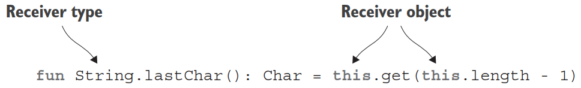
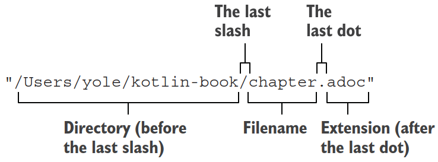
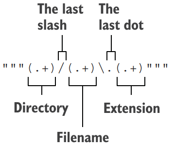
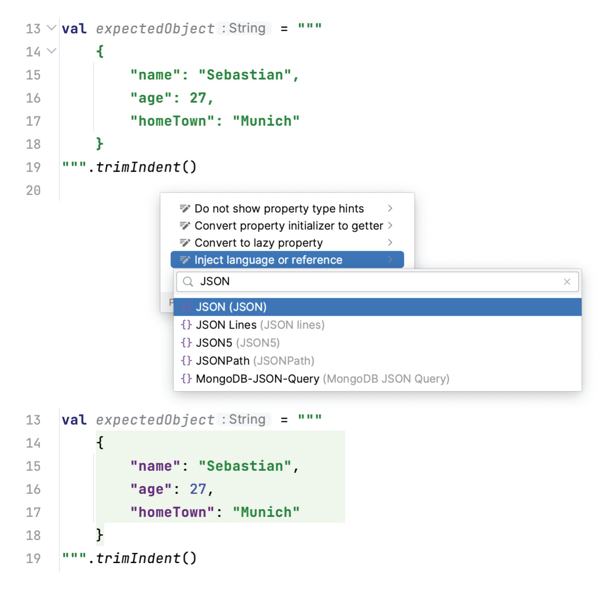
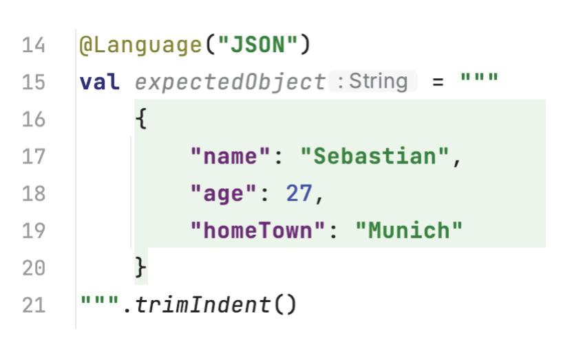

# 函数

2025-12-24⭐
@author Jiawei Mao
***
## 创建集合

- 创建 Set: `setOf`

```kotlin
val set = setOf(1, 7, 53)
```

- 创建 list: `listOf`

```kotlin
val list = listOf(1, 7, 53)
```

- 创建 map: `mapOf`

```kotlin
val map = mapOf(1 to "one", 7 to "seven", 53 to "fifty-three")
```

> [!NOTE]
>
> 这里 `to` 是一个函数

- 查看对象类型

```kotlin
val set = setOf(1, 7, 53)
val list = listOf(1, 7, 53)
val map = mapOf(1 to "one", 7 to "seven", 53 to "fifty-three")

println(set.javaClass) // javaClass 等价于 Java 的 getClass()
// class java.util.LinkedHashSet

println(list.javaClass)
// class java.util.Arrays$ArrayList

println(map.javaClass)
// class java.util.LinkedHashMap
```

如你所见，Kotlin 没有重新实现集合类，而是使用标准的 Java 集合类。

与 Java 不同的是，Kotlin 的集合接口默认 read-only，在集合主题会详细讨论。

- 扩展功能

虽然 Kotlin 的基本集合与 Java 集合完全相同，但 kotlin 提供更多功能。

```kotlin
val strings = listOf("first", "second", "fourteenth")

strings.last() // 获取最后一个元素
// fourteenth

println(strings.shuffled()) // 洗牌
// [fourteenth, second, first]

val numbers = setOf(1, 14, 2)
println(numbers.sum()) // 加和
```

下面详细讨论其工作原理和新方法的来源。

## 调用函数

Java 集合有一个默认 `toString` 实现，但是输出格式固定，不一定是你想要的：

```kotlin
fun main() {
    val list = listOf(1, 2, 3)
    println(list) 
    // [1, 2, 3]
}
```

假设你需要用括号代替方括号，用分号代替逗号。手动实现该功能：

```kotlin
fun <T> joinToString(
    collection: Collection<T>,
    separator: String = "",
    prefix: String = "",
    postfix: String = ""
): String {
    val result = StringBuilder(prefix)
    for ((index, element) in collection.withIndex()) {
        if (index > 0) // 第一个元素前不加 separator
            result.append(separator)
        result.append(element)
    }
    result.append(postfix)
    return result.toString()
}
```

该函数是泛型，适合任意类型元素的集合，泛型语法与 Java 类似。

该实现没问题。下面重点关注函数声明：如何更改函数声明使其调用更简单。

### 命名参数

- Java 中调用函数的方式 - 不容易判断每个参数的含义

```java
joinToString(collection, " ", " ", ".")
```

- Kotlin 调用函数时可以指定所有或部分参数名称

```kotlin
joinToString(collection, separator = " ", prefix = " ", postfix = ".")
```

如果指定所有参数名称，可以更改参数顺序：

```kotlin
joinToString( 
    postfix = ".",
    separator = " ", 
    collection = collection, 
    prefix = " "
)
```

### 默认参数值

在 Kotlin 中，可以在函数声明中指定参数默认值，从而避免重载。下面使用该方法改进 `joinToString` 函数 - 用逗号分隔元素，不带前缀和后缀：

```kotlin
fun <T> joinToString(
    collection: Collection<T>,
    separator: String = ", ",
    prefix: String = "",
    postfix: String = ""
): String {...}
```

现在，可以使用所有参数调用该函数，也可以省略一些参数：

```kotlin
fun main() {
    val list = listOf(1, 2, 3)
    joinToString(list, ", ", "", "")
    // 1, 2, 3
    joinToString(list)
    // 1, 2, 3
    joinToString(list, "; ")
    // 1; 2; 3
}
```

使用常规语法调用函数时，参数顺序与函数声明要一致，并且只能省略末尾参数。

使用命名参数语法，则可以省略任意参数，按任意顺序指定参数。

> [!NOTE]
>
> 鉴于 Java 没有默认参数值的概念，当从 Java 调用 Kotlin 函数时，必须明确指定所有参数值。如果你需要经常从 Java 调用某个 Kotlin 函数，并且希望让调用者更容易使用，可以使用 `@JvmOverloads` 注释。该注释使编译器生成带 Java 冲在的方法，从最后一个参数开始，逐个省略参数。例如，可以使用 `@JvmOverloads` 注释 `joinToString` 函数。

```kotlin
@JvmOverloads
fun <T> joinToString(
    collection: Collection<T>,
    separator: String = ", ",
    prefix: String = "",
    postfix: String = ""
): String {...}
```

编译会生成如下重载方法，每个重载方法都使用签名中被省略参数的默认值：

```java
String joinToString(Collection<T> collection, String separator, 
                    String prefix, String postfix);

String joinToString(Collection<T> collection, String separator, 
                    String prefix);

String joinToString(Collection<T> collection, String separator);

String joinToString(Collection<T> collection);
```

### 顶层函数与属性

作为一个面向对象语言，Java 要求所有代码都必须写成类的方法。导致出现许多没有状态、只包含静态方法的类，如 JDK 中的 `Collections` 以及许多工具包中的 `Util`。

Kotlin 以直接把函数放在源文件的顶层，不需要放在任何类中。例如，将 `joinToString` 函数放在 `strings` package 中，创建 `join.kt` 保存：

```kotlin
package strings

fun <T> joinToString(...): String {...}
```

编译该文件，会产生一些类，因为 JVM 只能在类中执行代码。如果需要从 Java 调用 Kotlin，就必须了解 它如何被编译的。下面是编译成同一个类的 Java 代码：

```java
package strings;

public class JoinKt {
	public static String joinToString(/* ... */) { /* ... */ }
}
```

可以看到，Kotlin 编译生成的类名对应包含函数的文件名——大写以匹配 Java 命名方式，并**以 Kt 作为后缀**。文件中所有顶层函数都被编译为 static 方法。因此，从 Java 调用该函数与调用其它 static 方法一样：

```java
/* Java */
import strings.JoinKt;

/* ... */
JoinKt.joinToString(list, ", ", "", ""); 
```

> [!TIP]
>
> **修改文件类名**
>
> 编译器生成的类名与文件名对应，添加 `Kt` 后缀。可以使用文件范围注释  `@file:JvmName("...")` 修改包含 Kotlin 顶层函数的生成类名（注释放在文件开头）。
>
> ```kotlin
> @file:JvmName("StringFunctions") // 指定类名
> 
> package strings // package 声明在文件注释后
> 
> fun joinToString(/* ... */): String { /* ... */ }
> ```
>
> 此时在 Java 中的调用方式：
>
> ```java
> import strings.StringFunctions; 
> StringFunctions.joinToString(list, ", ", "", "");
> ```

**顶层属性**

属性也可以放在文件顶层。例如，可以使用 `var` 属性统计操作执行次数：

```kotlin
var opCount = 0 // 声明顶层属性

fun performOperation() {
	opCount++  // 修改属性值
	// ...
}

fun reportOperationCount() {
	println("Operation performed $opCount times") // 查看属性值
}
```

该属性值存储在 static 字段中。

还可以使用顶层属性定义常量：

```kotlin
val UNIX_LINE_SEPARATOR = "\n"
```

顶层属性通过 accessor 方法提供给 Java（`val` 属性的 getter, `var` 属性的 getter-setter）。

如果想将其作为 `public static final` 字段提供给 Java，可以使用 `const` 修饰：

```kotlin
const val UNIX_LINE_SEPARATOR = "\n"
```

与以下 Java 代码等效：

```java
/* Java */
public static final String UNIX_LINE_SEPARATOR = "\n";
```

## 为其它类添加方法：扩展函数和属性

**扩展函数（extension function）**: 定义在类之外，但可以作为类的成员函数调用。

**示例**：获得字符串的最后一个字符

```kotlin
package strings

fun String.lastChar(): Char = this.get(this.length - 1)
```

**扩展方法**：在函数名称前添加类或接口的名称

类名称为**接收类型**（receiver type），调用扩展函数的值称为**接收对象**（receiver object）。



可以使用与普通类成员相同的语法来调用该函数：

```kotlin
fun main() { 
    println("Kotlin".lastChar())
    // n
}
```

在该示例中，`String` 为接收类型，`"Kotlin"` 为接收对象。

从某种意义上说，这里给 `String` 类添加了自定义方法。即使 `String` 不是你的代码，甚至你没有 `Strihng` 的源代码，无论 `String` 是来自 Java, Kotlin 或 Groovy 等其它 JVM 语言，即使被标记为 `final`，都可以通过该方法进行扩展。

在扩展函数中，使用 `this` 的方式与在 `String` 内部方法一样，因此可以省略：

```kotlin
fun String.lastChar(): Char = get(length - 1)
```

在扩展函数中可以直接访问扩展类的方法和属性，就像类本身定义的方法一样。但扩展函数不能破坏封装，因此**不能访问**类中的 `private` 和 `protected` 成员。

 下面将类的成员函数和扩展函数统称为**方法**（method）。

### 导入扩展函数

扩展函数需要单独导入，导入语法与类相同：

```kotlin
import strings.lastChar

val c = "Kotlin".lastChar()
```

或者采用通配符：

```kotlin
import strings.*

val c = "Kotlin".lastChar()
```

还可以使用 `as` 关键字更改导入的类或函数的名称：

```kotlin
import strings.lastChar as last

val c = "Kotlin".last()
```

当在不同 packages 中有多个同名函数，改名很有用：

- 对普通类或函数，可以使用完全限定名来避免命名冲突
- 对扩展函数，语法要求你必须使用简短名称，此时导入语句中的 `as` 是解决命名冲突的唯一方法

### Java 中调用扩展函数

扩展函数底层是一个静态方法，第一个参数为接收对象。所以从 Java 调用扩展函数很简单。java 类的名称根据函数声明的文件名称确定。假设在 `StringUtil.kt` 文件中声明，那么在 Java 中调用：

```java
/* Java */
char c = StringUtilKt.lastChar("Java");
```

### 工具函数作为扩展

下面实现 `joinToString` 的最终版，将其声明为 `Collection<T>` 的扩展函数：

```kotlin
fun <T> Collection<T>.joinToString(
    separator: String = ", ",
    prefix: String = "",
    postfix: String = ""
): String {
    val result = StringBuilder(prefix)
    for ((index, element) in this.withIndex()) { // this 引用接收对象，为 Collection<T> 类型
        if (index > 0) result.append(separator)
        result.append(element)
    }
    result.append(postfix)
    return result.toString()
}
```

```kotlin
fun main() {
    val list = listOf(1, 2, 3)
    println(list.joinToString(separator = "; ", prefix = "(", postfix = ")"))
    // (1; 2; 3)
}
```

扩展函数实际上是 static 方法调用的语法糖，因此可以使用更特异性的类型作为接收器类型。例如，专用于字符串集合的链接函数：

```kotlin
fun Collection<String>.join(
    separator: String = ", ",
    prefix: String = "",
    postfix: String = ""
) = joinToString(separator, prefix, postfix)

fun main() {
	println(listOf("one", "two", "eight").join(" "))
	// one two eight
}
```

由于扩展函数本质上是 static 函数，因此不能在子类中覆盖。

### 不能覆盖扩展函数

Kotlin 的方法覆盖对成员函数正常，但不能覆盖扩展函数。

假设你有两个类 `View` 和 `Button`。`Button` 是 `View` 的子类，并覆盖父类中的 `click` 方法。为了实现该功能，将 `View` 和 `click` 标记为 `open`，表示允许覆盖，并在子类中用 `override` 标记覆盖实现。

```kotlin
open class View { // View 为 open，以允许继承
	open fun click() = println("View clicked") // lick 为 open，以允许覆盖
}

class Button: View() { // Button 扩展 View
	override fun click() = println("Button clicked") // 覆盖 click 实现
}
```

声明一个类型为 `View` 的变量，可以在该变量存储类型为 `Button` 的值，因为 `Button` 是 `View` 的子类。如果调用一个常规方法，例如 `click`，并且该方法在 `Button` 中覆盖，那么将使用 `Button` 类中的实现：

```kotlin
fun main() {
    val view: View = Button()
    view.click() // 根据实际值调用方法
    // Button clicked
}
```

但这对扩展函数不成立，扩展函数本质上不属于类。例如，下面示例显示 `View` 和 `Button` 类上声明的两个 `showOff` 扩展函数。当对 `View` 类型的变量调用 `showOff()` 时，即使该值的实际类型是 `Button`，也会调用 `View` 的 `showOff`。

```kotlin
fun View.showOff() = println("I'm a view!")
fun Button.showOff() = println("I'm a button!")

fun main() {
    val view: View = Button()
    view.showOff() // 扩展函数静态解析
    // I'm a view!
}
```

扩展函数在 Java 中被编译为静态函数，并以接受者作为第一个参数。在 Java 中的代码：

```java
/* Java */ 
class Demo {
    public static void main(String[] args) {
        View view = new Button(); 
        ExtensionsKt.showOff(view); // showOff函数定义在 extensions.kt 文件中
        // I'm a view!
    }
}
```

> [!NOTE]
>
> 如果类中有一个与扩展函数签名相同的成员函数，那么成员函数优先。
>
> 如果添加一个与扩展函数同名的成员函数，重新编译后，新的代码开始引用新的成员函数。

### 扩展属性

通过 property 语法为已有类添加属性。

将之前的扩展函数 `lastChart()` 转换为属性，就可以通过 `"myText".lastChar` 而不是 `"myText".lastChar()` 访问。

```kotlin
val String.lastChar: Char
	get() = this.get(length - 1)
```

扩展属性添加添加了接收类。必须定义 getter，因为没有支持字段，因此没有默认的 getter 实现。出于同样的原因，不能初始化，因为没有地方存储初始化值。

如果在 `StringBuilder` 上定义相同属性，则可以声明为 `var`，因为 `StringBuilder` 的内容可以修改。

```kotlin
var StringBuilder.lastChar: Char 
    get() = this.get(length - 1)  // getter
    set(value) {                  // setter
    	this.setCharAt(length - 1, value) 
    }
```

扩展属性的访问方式与成员属性相同：

```kotlin
fun main() {
    val sb = StringBuilder("Kotlin?")
    println(sb.lastChar) 
    // ?
    sb.lastChar = '!' 
    println(sb)
    // Kotlin!
}
```

从 Java 中访问扩展属性，必须显式调用 getter 和 setter: `StringUtilKt.getLastChar("Java")` 和 `StringUtilKt.setLastChar(sb, '!')`。

## 集合：varargs, infix call, library

下面介绍 Kotlin 标准库中一些处理集合的函数：

- `vararg` 关键字 - 声明任意参数量的函数
- *infix* 表示法，便于调用单参数 函数
- 解构声明，将单个符合值拆分为多个变量

### 扩展 Java 集合 API

Kotlin 的集合与 Java 中的类相同，但扩展了 API。例如：

```kotlin
fun main() {
    val strings: List<String> = listOf("first", "second", "fourteenth")
    strings.last()
	// fourteenth

    val numbers: Collection<Int> = setOf(1, 14, 2)
    numbers.sum()
	// 17
}
```

Kotlin 中对 Java 集合的扩展 API 都是通过扩展函数实现，如上面的 `last` 和 `sum` 函数，并且默认导入 Kotlin 文件中。

`last` 函数与前面介绍了 `lastChar` 类似，只是作为 `List` 类的扩展。对 `sum`，下面展示一个简化的声明：

```kotlin
fun <T> List<T>.last(): T { /* returns the last element */ } 
fun Collection<Int>.sum(): Int { /* sum up all elements */ }
```

Kotlin 标准库中列出了每个库可用的方法（成员和扩展）：https://kotlinlang.org/api/core/kotlin-stdlib/

### varargs

调用 `listOf` 函数创建 list 时，可以传入任意数量参数：

```kotlin
val list = listOf(2, 3, 5, 7, 11)
```

`listOf` 在标准库中的函数签名如下：

```kotlin
public fun <T> listOf(vararg elements: T): List<T>{...}
```

该方法通过任意数量的值打包为数组传递给方法。Kotln 的 varargs 与 Java 类似，但语法略有不同：类型后面不是三个点，而不是在参数上使用 `vararg` 修饰符。

另外调用语法也有区别：当你需要传递的参数为数组，在 Java 中可以直接传入数组，而 Kotlin 就要求解包数组，使得数组的每个元素为被调用函数的一个独立参数。这一特性称为扩散算子（spread operator），将 `*` 放在数组前面即可。

**示例**：将传递给 `main` 函数的命令行参数 `args` 作为 `listOf` 函数的可变参数

```kotlin
fun main(args: Array<String>) {
    val list = listOf("args: ", *args)
    println(list)
}
```

这里通过 spread 算子将 "args: " 参数与数组合并，Java 不支持该功能。

### Infix 和解构

使用 `mapOf` 函数创建 map：

```kotlin
val map = mapOf(1 to "one", 7 to "seven", 53 to "fifty-three")
```

其中 `to` 不是 Kotlin 内置构造，而是一种特殊类型的方法调用，即中缀调用（infix）。

在中缀调用中，方法名称直接放在目标对象和参数之间，没有额外分隔符。以下两个调用等价：

```kotlin
1.to("one") 
1 to "one"
```

只需要一个参数的常规方法和扩展函数调用都可以使用 infix 调用。不过需要用 `infix` 标记一下函数。下面是 `to` 函数声明的简化版本：

```kotlin
infix fun Any.to(other: Any) = Pair(this, other)
```

`to` 函数返回 `Pair` 实例，属于 Kotlin 标准库的一个类。

可以使用 `Pair` 的内容初始化两个变量：

```kotlin
val (number, name) = 1 to "one"
```

该特性称为解构。

解构声明不限于 `Pair`。例如，集合的 `withIndex()` 解构：

```kotlin
for ((index, element) in collection.withIndex()) {
	println("$index: $element")
}
```

`to` 函数是一个扩展函数，可用于创建任意一对元素。`mapOf` 函数签名：

```kotlin
fun <K, V> mapOf(vararg values: Pair<K, V>): Map<K, V>
```

和 `listOf` 类似，`mapOf` 接收可变数量参数，但要求是 key-value 对。

## 字符串和正则表达式

Kotlin 字符串与 Java 字符串完全一样：可以将 Kotlin 代码创建的字符串直接传递给任何 Java 方法，也可以将代码代码生成的字符串传递给需要字符串的任何 Kotlin 标准库方法。不涉及转换，也不会创建额外包装对象。

Kotlin 为标准 Java 字符串提供了许多扩展函数，使得使用起来更方便。

### 拆分字符串

Java 中 `String` 的 `split` 方法不支持 dot。例如，`"12.345-6.A".split(".")` 期望生成 `[12, 345-6, A]` 数组，但实际返回空数组。因为 `split` 参数被当作正则表达式处理，`.` 表示任意字符。

Kotlin 隐藏了这个我令人困惑的方法，并用几个名为 `split` 但参数不同的重载扩展替代。采用正则表达式的扩展参数类型为 `Regex` 或 `Pattern`，而不是 `String`。

**示例**：使用 `.` 或 `-` 拆分字符串

```kotlin
println("12.345-6.A".split("\\.|-".toRegex()))
// [12, 345, 6, A]
```

Kotlin 的正则表达式语法与 Java 完全相同。这个对 `.` 进行转义，表示匹配字面量 `.`，而不是匹配任意字符。

不过，对这种简单情况其实不需要正则表达式。另一个 `split` 扩展函数采用任意数量的字符串分隔符作为参数：

```kotlin
println("12.345-6.A".split(".", "-"))
// [12, 345, 6, A]
```

这里也可以使用字符 `"12.345-6.A".split('.', '-')`，结果相同。

### 正则表达式和三引号字符串

解析将文件的完整路径，拆分为：目录、文件名和扩展名。这里介绍两种实现：`String` 扩展和正则表达式。Kotlin 标准库提供获取给定分隔符前、后子串的函数。



- `String` 扩展实现

```kotlin
fun parsePath(path: String) {
    val directory = path.substringBeforeLast("/")
    val fullName = path.substringAfterLast("/")

    val fileName = fullName.substringBeforeLast(".")
    val extension = fullName.substringAfterLast(".")

    println("Dir: $directory, name: $fileName, ext: $extension")
}

fun main() {
    parsePath("/Users/yole/kotlin-book/chapter.adoc")
    // Dir: /Users/yole/kotlin-book, name: chapter, ext: adoc
}
```

Kotlin 使字符串处理更简单，无需依赖正则表达式。正则表达式有时候真不好理解。

- 正则表达式实现

```kotlin
fun parsePathRegex(path: String) {
    val regex = """(.+)/(.+)\.(.+)""".toRegex()
    val matchResult = regex.matchEntire(path)
    if (matchResult != null) {
        val (directory, filename, extension) = matchResult.destructured
        println("Dir: $directory, name: $filename, ext: $extension")
    }
}

fun main() {
    parsePathRegex("/Users/yole/kotlin-book/chapter.adoc")
	// Dir: /Users/yole/kotlin-book, name: chapter, ext: adoc
}
```

这里正则表达式用三引号字符串。在三引号中，不需要转义字符，包括反斜杠，因此可以使用 `\.` 匹配一个字面量 `.`，而不是 `\\.`。



该正则表达式将路径分为三部分：`(.+)` 匹配分隔符以外的内容。

### 多行三引号字符串

三引号字符串除了避免字符转义，还可以包含任意字符，包括换行符，因此很适合在程序中嵌入包含换行符的文本。

```kotlin
val kotlinLogo =
    """
    | //
    |//
    |/ \ 
    """.trimIndent()

fun main() {
    println(kotlinLogo)
}
```

```
| //
|//
|/ \ 
```

`trimIndent` 删除所有行的公共缩进，并删除收尾空白行。

三引号字符串可以包含换行符，但不能使用特殊字符，例如 `\n`。另外，不需要转义 `\`，因此 Windows 路径 `"C:\\Users\\yole\\kotlin-book"` 可以写为 `"""C:\Users\yole\kotlin-book"""`。

三引号字符串中可以使用字符串模板，但由于多行字符串中不支持转义，如果需要在字符串中包含美元符号或 Unicode 字面量，就必须使用嵌入表达式。因此 `val think = """Hmm \uD83E\uDD14"""` 不行，`valthink = """Hmm ${"\uD83E\uDD14"}"""` 才行。

多行字符串在测试中非常有用。例如，测试产生多行文本，将其与期望比较。不需要费力转义，将期望文本放在三引号中即可。为了更好格式化，还可以加上 `trimIndent` 函数。例如：

```kotlin
val expectedPage = """
    <html lang="en">
    <head>
    <title>A page</title> 
    </head>
    <body>
    <p>Hello, Kotlin!</p>
    </body> 
    </html>
""".trimIndent()

val expectedObject = """
    {
    "name": "Sebastian", 
    "age": 27, 
    "homeTown": "Munich"
    }
""".trimIndent()
```

> [!TIP]
>
> **Intellij IDEA 和 Android Studio 中三引号字符串语法高亮**
>
> Alter-Enter,选择 Inject Language or Reference。然后选择文本的语言类型（如 JSON, XML）。那么多行字符串就变成正确语法高亮的 JSON。如果文本的 JSON 格式有误，还可以看到错误提示。
>
> 这个文本高亮是暂时的。要指示 IDE 始终高亮指定字符串字面量，可以使用 `@Language("JSON")` 注释。





> [!NOTE]
>
> Kotlin 扩展函数很强大，Kotlin 标准库中很大一部分是标准 Java 类的扩展函数。

## 局部函数与扩展

许多开发者认为，优秀代码最重要的是避免重复。即 **DRY**（don't repeat yourself）。但在 Java 中有时候很难遵循该原则。很多时候，你可以使用 IDE 的 Extract 方法重构代码，将较长的方法拆分为更小的块。但这会让代码更难理解。也可以更进一步，将提取的方法放到内部类，但这种方法需要许多样板代码。

Kotlin 可以将提取的函数包含在函数内部。下面介绍如何使用局部函数修复常见代码重复的情况。

**示例**：将用户信息保存到数据库

```kotlin
class User(val id: Int, val name: String, val address: String)

fun saveUser(user: User) {
    if (user.name.isEmpty()) {
        throw IllegalArgumentException(
            "Can't save user ${user.id}: empty Name"
        )
    }

    if (user.address.isEmpty()) {
        throw IllegalArgumentException(
            "Can't save user ${user.id}: empty Address"
        )
    }

	// Save user to the database
}

fun main() {
    saveUser(User(1, "", ""))
	// java.lang.IllegalArgumentException: Can't save user 1: empty Name
}
```

这里字段验证代码是重复的。这里代码重复很少，但在类中添加一个专门处理用户验证的方法似乎也没必要。局部函数可以帮助去除重复，同时保持代码结构清晰。

```kotlin
class User(val id: Int, val name: String, val address: String)

fun saveUser(user: User) {

    fun validate( // 声明验证字段的本地函数
        user: User,
        value: String,
        fieldName: String
    ) {
        if (value.isEmpty()) {
            throw IllegalArgumentException(
                "Can't save user ${user.id}: empty $fieldName"
            )
        }
    }

    validate(user, user.name, "Name")
    validate(user, user.address, "Address")

	// Save user to the database
}
```

局部函数可以访问外部函数的所有参数和变量，因此可以去除 `User` 参数：

```kotlin
class User(val id: Int, val name: String, val address: String)

fun saveUser(user: User) {
    fun validate(value: String, fieldName: String) { // 去除了 User 参数
        if (value.isEmpty()) {
            throw IllegalArgumentException( // 直接访问外部函数的参数
                "Can't save user ${user.id}: " +
                        "empty $fieldName"
            )
        }
    }

    validate(user.name, "Name")
    validate(user.address, "Address")

    // Save user to the database
}
```

将验证逻辑迁移到 `User` 类的扩展函数：

```kotlin
class User(val id: Int, val name: String, val address: String)

fun User.validateBeforeSave() {
    fun validate(value: String, fieldName: String) {
        if (value.isEmpty()) {
            throw IllegalArgumentException( // 直接访问 User 属性
                "Can't save user $id: empty $fieldName"
            )
        }
    }

    validate(name, "Name")
    validate(address, "Address")
}

fun saveUser(user: User) {
    user.validateBeforeSave()

	// Save user to the database
}
```

将代码提取到扩展函数出乎意料的有用。虽然 `User` 是代码库的一部分，但我们不想将逻辑放在 `User` 中，因为他和 `User` 其它使用情况无关。采用该方法，`User` 类只包含所有地方都会用到的基本方法，所以类更小，易于理解。

扩展函数也可以声明为局部函数，不过深度嵌套的局部函数不容易阅读，不建议使用超过一层的嵌套。
