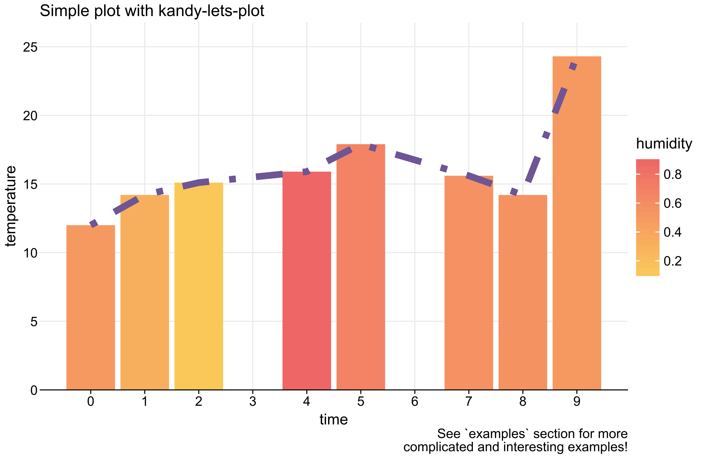

# Kandy 概览

2025-12-22⭐
@author Jiawei Mao
***
## Kandy 是什么

Kandy 是一个为 Kotlin 涉及的开源数据可视化库。它采用现代数据可视化方法，提供灵活的 DSL。该 DSL 与 Kotlin 的类型安全无缝集成，便于快速生成图表。Kandy 还支持多种流行引擎，提升了其功能和性能，实现高效的图表构建。

Kandy 利用 [Lets-Plot 库](https://github.com/JetBrains/lets-plot-kotlin) 在交互式笔记本中显示，保存为独立的 HTML 文件，或导出为 PNG, SVG 和 JPEG 格式。该功能使得可以在 Kotlin 项目中使用 Kandy。

除了 kandy-lets-plot，还有一个正在开发的 kandy-echarts，这是一个利用 echarts.js 进行渲染的试验模块。

## 特点

- 分层 DSL - 提供直观、直接的方法构建 graphs
- 支持 Kotlin notebooks - 支持 IntelliJ IDA 上的 Kotlin Notebook 插件，Datalore 和 Jupyter Notebook 平台使用
- Kotlin notebook 中的 Swing 渲染 - 在 IntelliJ IDEA 中支持
- 交互式 tooltips - 在 Swing 和 HTML 渲染中提供动态 tooltip
- 支持 Kotlin 集合 - 支持直接使用 Kotlin 的标准集合作为数据源
- 支持 Kotlin DataFrame - 集成 Kotlin DataFrame
- 类型和 null 安全 - 确保类型安全和 Kotlin null 安全

## DSL 和语法

Kandy 提供了一个通用 API，生成 plot 的中间表示（Intermediate Representation, IR）。kandy-lets-plot 和 kandy-echarts 都与该 API 兼容。

Kanddy 的 DSL 提供一种直观的、分层的方法来创建数据可视化。其灵活且结构化的设计适合初学者和经验丰富的用户。以下是 Kandy DSL 结构的简要概述：


- **Plot** - `plot` block 是 Kandy 中所有可视化的基础，为所有其它元素奠定基础
- **Data Manipulation** - 用于数据处理
  - **Grouping** - 根据指定 key 对数据分组，可用于对不同数据段进行不同可视化
  - **Statistical** - 对数据应用统计操作
- **Layout** - 用于处理 graph 的设计，包括标题、副标题、尺寸和主题等
- **Layers** - 引入不同类型的视觉元素，如点、点、bar 等
- **Aesthetic Mappings / Settings** - 将数据属性映射到颜色、形状和大小等视觉属性，从而提供更广泛的自定义选项
- **Scale Specification** - 处理数据转换为图表上视觉元素的比例，包括颜色渐变、大小范围和位置等

Kandy 的 DSL 为创建可视化提供了一天简单的途径，将清晰度和审美结合在一起。其设计注重易用性，能够高效制作复杂的图表。

### 语法

Kandy 的 API 遵循以下结构：

- 初始数据的基本绘图

```kotlin
plot(data) {
    // layer (geoms)
    line[bars | points | area | pie | ...] {
        ... // aesthetics
    }

    line[bars | points | area | pie | ...] {
        ...
    }

      ...
}
```

- 转换数据

```kotlin
plot(data) {
    // data manipulation
    groupBy(Strings| Columns) [statBin|statBoxplot|statDensity|...] {
        line[bars | points | area | pie | ...] {
            ...
        }
        line[bars | points | area | pie | ...] {
            ...
        }

      ...
    }
}
```

- 结合原始和转换数据

```kotlin
plot(data) {
    groupBy(Strings| Columns) [statBin|statBoxplot|statDensity|...] {
        line[bars | points | area | pie | ...] {
            ...
        }
        line[bars | points | area | pie | ...] {
            ...
        }
      ...
    }

    line[bars | points | area | pie | ...] {
        ...
    }
    line[bars | points | area | pie | ...] {
        ...
    }

      ...
}
```

- 修改 plot layout

```kotlin
plot(data) {
    line[bars | points | area | pie | ...] {
        ...
    }
      ...

    layout {
        title
        subtitle
          ...
        theme { ... }
        legend { ... }
        grid { ... }
          ...
    }
}
```

对 mappings 和设置，Kandy 采用如下方法：

- 映射到集合或 column，通过调用函数实现

```kotlin
x("time") // map to the column `time`
y(listOf(1, 2, 3)) // map to a list
color(type) // map to the type column
```

- 设置位置

```kotlin
x.constant(3)
yIntercept.constant(5.7)
```

- 其它美学设置

```kotlin
color = Color.RED
size = 4.5
type = LineType.DASHED
```

**使用 DataFrame 作为数据源**

```kotlin
val weatherData = dataFrameOf(
    "time" to listOf(0, 1, 2, 4, 5, 7, 8, 9),
    "temperature" to listOf(12.0, 14.2, 15.1, 15.9, 17.9, 15.6, 14.2, 24.3),
    "humidity" to listOf(0.5, 0.32, 0.11, 0.89, 0.68, 0.57, 0.56, 0.5)
)

weatherData.plot { // Begin plotting
    x(time) // Set x-axis with time data
    y(temperature) { // Set y-axis with temperature data
        // Define scale for temperature (y-axis)
        scale = continuous(0.0..25.5)
    }

    bars { // Add a bar layer
        fillColor(humidity) { // Customizing bar colors based on humidity
            // Setting the color range
            scale = continuous(range = Color.YELLOW..Color.RED)
        }
        borderLine.width = 0.0 // Define border line width
    }

    line {
        width = 3.0 // Set line width
        color = Color.hex("#6e5596") // Define line color
        type = LineType.DOTDASH // Specify the line type
    }

    layout { // Set plot layout
        title = "Simple plot with kandy-lets-plot" // Add title
        // Add caption
        caption = "See `examples` section for more\n complicated and interesting examples!"
        size = 700 to 450 // Plot dimension settings
    }
}
```

