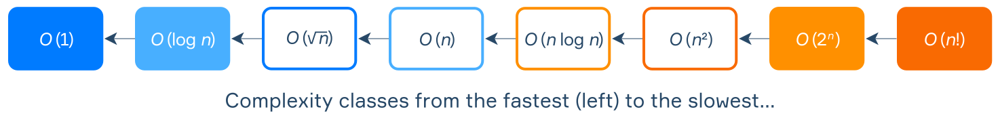

# 算法效率和数据编码

## 比价算法

假设你需要从多种算法中选择一个来解决某个问题，要选出最优的那个，就需要以某种方式衡量算法的效率。

一种方法是记录程序处理输入所需的时间，然而，不同的计算机处理相同数据所需的时间可能不同。此外，处理时间还可能取决于数据本身。显然，我们需要一种更通用的方法。而**大 O 表示法**是一种最常用的估算算法效率的方法。

### 输入规模

算法通常会执行一些计算，我们将**常数时间操作**称为基本操作，比如加法、乘法、比较、变量赋值等。当然，计算的速度还取决于使用的机器，但因为我们要比较的是算法，而非机器，因此我们用操作次数比较算法。

当然，算法的运行时间取决于输入数据量（input size），找出前 10 个质数和前 10000 个质数所花时间肯定不同。如果能够估算操作次数随输入规模的变化，就得到一种与机器无关的算法复杂度的衡量方式。

此外，如果想要找到一个优秀的算法，我们通常更关系它在大数据下的表现，为此，我们可以将算法的运行时间变化趋势与一些标准函数进行比较。

### 从代码理解复杂度

大 O 表示法用于描述算法的 运行速度如何随输入规模的增大和变化。本质上，这是一种简单易懂、用来比价和理解算法“数量级”的方法。下面通过伪代码示例来介绍大 O 表示法。

当算法的执行时间随输入规模 $n$ 线性增长时，就称为**线性复杂度**（linear complexity）。例如，若循环的每一次迭代都执行常数时间操作，那么随着输入规模增大，执行时间也会成比例增加：

```kotlin
for i = 1 to n:
    // 常数时间操作
    // ...
```

嵌套循环会产生二次方的事件复杂度 $O(n^2)$。因为外层循环没执行一次，内层循环就要遍历 $n$ 个值，总迭代次数为 $n^2$：

```kotlin
for i = 1 to n:
    for j = 1 to n:
        // Constant-time operations
        // ...
```

如果存在多个不相关的循环，则只需要考虑耗时最长的那个。例如，下面算法的复杂度为二次方，因为第二个循环比第一个更耗时：

```kotlin
// 线性循环
for i = 1 to n:
    // 常量时间操作
    // ...

// 嵌套循环
for i = 1 to n:
    for j = 1 to n:
        // 常量时间操作
        // ...
```

### 常见算法复杂度

下面是一些常见的大 O 函数取值，复杂度从低到高，对应算法从优到劣：

- $O(1)$ (常数时间) - 算法执行固定次数操作，可能是 1次、2 次或 100 次，关键是**执行次数与输入规模**无关。典型算法有：直接用数学公式计算值、打印操作等。
- $O(\log n)$ （对数时间）- 算法执行次数是输入规模的对数，根据定义 $\log_2n$ 表示把 $n$ 除以 2，直到结果为 1 所需次数。不难猜到，这类算法每一步都会把问题规模减半，所以速度很快，即使输入规模很大（如 $2^{31}$），算法也只需要大约 31 次操作，效率非常高。
- $O(n)$ (线性时间) - 运行时间与输入规模成正比，即输入规模增大，时间也线性增长。这类算法通常只对数据遍历一次，这类算法非常常见，因为大多数算法往往需要查看每一个输入元素。这使得 $O(n)$ 在实践中常属于最高效的算法。
- $O(n^2)$ (平方时间) - 这类算法通常会遍历所有输入元素对。例如，对包含 $n$ 个元素的集合，无序元素对的数量为 $\frac{n(n-1)}{2}$，它的复杂度就是 $O(n^2)$。
- $O(2^n)$ (指数时间) - 在数学上，$n$ 个元素的集合的子集总数正好是 $2^n$，所以这类算法通常要枚举输入的所有子集。需要注意，这类算法效率很低，就是输入规模很小，算法耗时也会随输入规模增大急剧增加。

另外还有一些不常见的复杂度类型：

- $O(\sqrt{n})$ - 平方根
- $O(n\log n)$ - 线性对数
- $O(n^k)$ - 多项式
- $O(n!)$ - 阶乘

从优到劣汇总如下：



需要注意的是，在实践中，由于一些优化技术 ，理论复杂度更差的算法在**小规模输入**时可能表现更好。不过，我们主要关注 $n$ 较大的情况，大 O 表示法帮助我们理解当输入规模趋近于无穷时算法的表现。这能让我们了解算法长期的效率，当任务或数据量大幅增长时，这种趋势更为重要。

