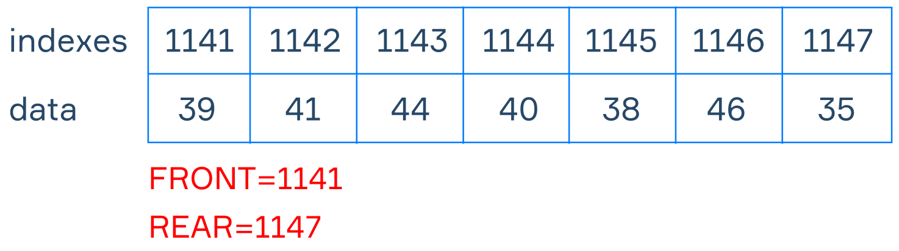
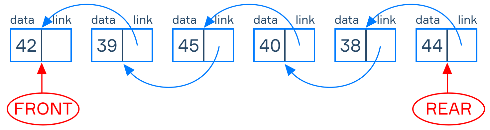
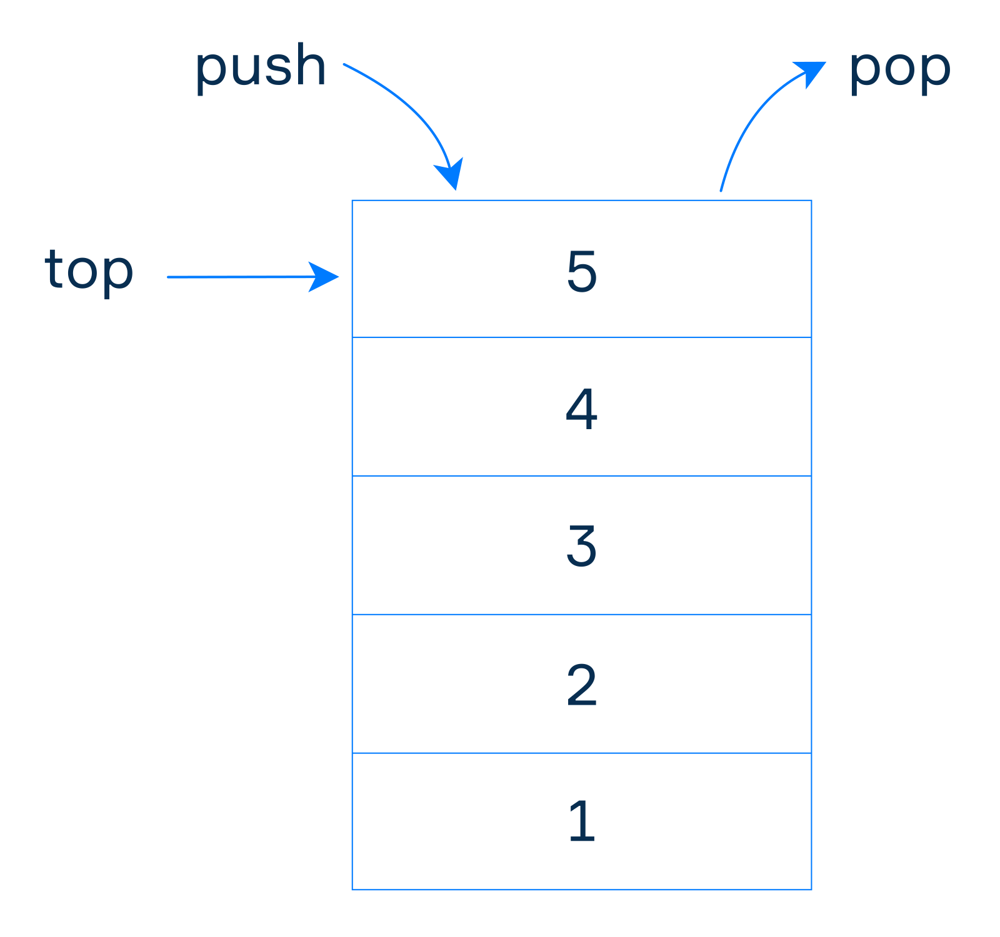
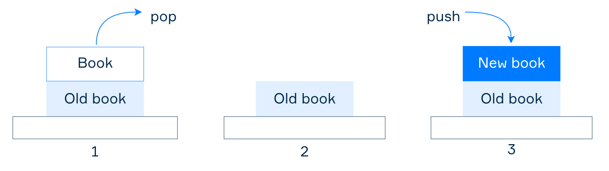

# 数据结构与算法

2026-02-03⭐
@author Jiawei Mao
***

## 简介

算法是为了实现某个结果需要执行的一系列操作。

程序和算法的区别：

- 算法是对操作步骤的描述，更为抽象
- 程序包含一系列指令，可以看作特定编程语言实现的算法

编程语言通常包含一些用于解决典型问题的基本算法实现。这些算法通常包含在标准库中，软件开发者可以直接使用，不必自定义实现。但是，了解这些算法的工作原理有助于高效使用它们。

## 数据结构

算法离不开数据结构，不管实现什么算法，都需要考虑数据存储问题。**数据结构**以特定方式存储和操作数据。常见数据结构：数组、链表、哈希表以及各种树（二叉搜索树、堆、红黑树、B 树等）。

为什么需要这么多种数据结构：不同数据结构的存储效率以及针对不同操作的时间复杂度不同，它们都有各自的应用场景。

以 Dijkstra 算法为例，它主要有两种实现，分别使用数组和堆作为数据结构：

- 数组：时间复杂度为 $O(n^2+m)$
- 堆：时间复杂度为 $O((n+1)\log n)$

所以，使用不同数据结构实现同一算法，时间复杂度也不同。

数据结构总结：

- 提供数据的高效存储和检索
- 旨在优化搜索、插入、删除等操作，确保算法的性能
- 提供可扩展性和灵活性，使系统在不牺牲性能的情况下处理数据的增长和变更
- 优化内存使用，管理内存的分配和释放
- 通过将数据和操作封装到可重用模块中，提高代码的可重用性，提高软件开发效率和可维护性

从用户视角，还有所谓的**抽象数据类型**（Abstract Data Type, **ADT**），ADT 定义数据类型的逻辑和行为，而数据结构是对 ADT 的精确实现，此时数据结构又称为具体数据类型（Concrete Data Type, CDT）。

下面介绍使用超广泛的两种数据结构：Queue 和 Stack。

## Queue

队列（queue）特点：先进先出（First In, First Out, **FIFO**）

队列只有两个操作：

- 入队（enqueue），添加元素到队列末尾
- 出队（dequeue），删除队列开头元素

队列有数组和链表两种常用实现。

**数组实现**

**链表实现**

链表实现需要消耗更多内存，所以在实践中通常采用数组实现。

## Stack

堆栈（stack）特点：后进先出（Last In, First Out, **LIFO**）

一摞书是现实生活中最简单的堆栈实例：

在编程中，堆栈用于：

- 计算算术表达式
- 存储函数的参数和函数调用的结果
- 颠倒元素顺序等