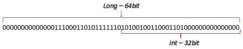

# Kotlin 数据类型操作

2026-01-15
@author Jiawei Mao
***
## 布尔操作

布尔类型只有两种值：`true` 和 `false`：

```kotlin
val t = true
val f = false

println(t) // true
println(f) // false
```

### 读取布尔值

在 Kotlin 1.4+，可以使用如下方式读取布尔值：

```kotlin
val b: Boolean = readLine().toBoolean()
```

在 Kotlin 1.6+，语法更简洁：

```kotlin
val b: Boolean = readln().toBoolean()
```

当输入为 "true"，`toBoolean()` 返回 `true` (不分区大小写)。否则，返回 `false`。

**示例**：对以下输入

```kotlin
true
True
TRuE
T
false
```

输出结果：

```kotlin
println(readln().toBoolean()) // true
println(readln().toBoolean()) // true
println(readln().toBoolean()) // true
println(readln().toBoolean()) // false
println(readln().toBoolean()) // false
```

从 Kotlin 1.5 开始，有其它函数可以将 `String` 转换为 `Boolean`：

- `toBooleanStrict()`: 字符串严格等于 "true" (区分大小写) 时返回 `true`，等于 "false" 时返回 `false`，否则抛出 `java.lang.IllegalArgumentException`
- `toBooleanStrictOrNull()`：字符串等于 "true" 时返回 `true` (区分大小写)，等于 "false" 时返回 `false`，否则返回 `null`

```kotlin
println("true".toBooleanStrict())     // true
// println("True".toBooleanStrict())  // program crashes
println("false".toBooleanStrict())    // false
// println("faLse".toBooleanStrict()) // program crashes

println("true".toBooleanStrictOrNull())  // true
println("false".toBooleanStrictOrNull()) // false
println("faLse".toBooleanStrictOrNull()) // null
```

### 逻辑运算符

布尔类型变量可以通过逻辑运算符构造逻辑语句。Kotlin 提供 4 个逻辑运算符：NOT, AND, OR, XOR。

- **NOT**，否，用 `!` 表示

```kotlin
val f = false // f is false
val t = !f    // t is true
```

- **AND**，与，用 `&&` 表示

```kotlin
val b1 = false && false // false
val b2 = false && true // false
val b3 = true && false // false
val b4 = true && true  // true 
```

- **OR**，或，用 `||` 表示

```kotlin
val b1 = false || false // false
val b2 = false || true  // true
val b3 = true || false  // true
val b4 = true || true   // true
```

- **XOR**，异或，用 `xor` 表示

```kotlin
val b1 = false xor false // false
val b2 = false xor true  // true
val b3 = true xor false  // true
val b4 = true xor true   // false
```

### 逻辑运算符优先级

1. NOT：`!`
2. XOR：`xor`
3. AND：`&&`
4. OR：`||`

## 类型转换

### 数值类型转换

`Int`, `Long` 和 `Double` 是最常见的三种数值类型。它们之间可以通过 `toInt()`, `toLong`, `toDouble()` 等进行转换。

例如，将 `Int` 转换为 `Double`：

```kotlin
val num: Int = 100

val res: Double = sqrt(num.toDouble())
println(res) // 10.0

println(num) // 100, 保持不变
```

> [!WARNING]
>
> `toDouble()` 不会修改 `num` 的类型，而是以相同值生成一个 `Double` 类型变量。

另外，与 Java 不同，Kotlin 不会自动将短类型转换为长类型。例如，Java 支持自动将 `int` 转换为 `long`，但 Kotlin 要求必须显式转换：

```kotlin
val num: Int = 100
val bigNum: Long = num.toLong() // 100
```

`Char` 不是数字类型，但可以根据字符代码将数字转换为字符，反之亦然：

```kotlin
val n1: Int = 125
val ch: Char = n1.toChar() // '}'
val n2: Int = ch.code      // 125
```

### 转换为 Short 或 Byte

`Short` 和 `Byte` 类型非常小，使用较少。但如果需要，可以使用 `toShort` 和 `toByte()` 从 `Int` 进行转换。对 `Double` 和 `Float`，要先转换为 `Int`：

```kotlin
val floatNumber = 10f
val doubleNumber = 1.0

val shortNumber = floatNumber.toShort() // 不支持
val byteNumber = doubleNumber.toByte()  // 不支持

val shortNumber = floatNumber.toInt().toShort() // 正确方式
val byteNumber = doubleNumber.toInt().toByte()  // 正确方式
```

### toString

`toString()` 获得对应类型的字符串表示。

```kotlin
val n = 8     // Int
val d = 10.09 // Double
val c = '@'   // Char
val b = true  // Boolean

val s1 = n.toString() // "8"
val s2 = d.toString() // "10.09"
val s3 = c.toString() // "@"
val s4 = b.toString() // "true"
```

字符串也可以转换为数字、布尔值：

```kotlin
val n = "8".toInt() // Int
val d = "10.09".toDouble() // Double
val b = "true".toBoolean() // Boolean
```

如果字符串表示格式不对，会抛出错误。布尔例外，当字符串为 "true" 时返回 `true`（不区分大小写），其它情况返回 `false`：

```kotlin
val b1 = "false".toBoolean() // false
val b2 = "tru".toBoolean()   // false
val b3 = "true".toBoolean()  // true
val b4 = "TRUE".toBoolean()  // true
```

### 类型转换问题

可以将 `Double` 类型转换为 `Int` 或 `Long`，例如：

```kotlin
val d: Double = 12.5
val n: Long = d.toLong() // 12
```

由于类型限制，小数部分被删掉了。因此使用时要小心。

将长类型转换为短类型也有类似问题（如 `Long` 或 `Double` 转换为 `Int`）。当值较小时没问题：

```kotlin
val d: Double = 10.2
val n: Long = 15

val res1: Int = d.toInt() // 10
val res2: Int = n.toInt() // 15
```

当值超出 `Int` 的最大值，则会截断：

```kotlin
val bigNum: Long = 100_000_000_000_000

val n: Int = bigNum.toInt() // 276447232; oops
```

这类问题称为类型溢出。

### 示例

```kotlin
fun main() {
    val something = readln()

    val d = something.toDouble()
    val f = d.toFloat()
    val i = f.toInt()
    val b = i.toByte()

    println(d)
    println(f)
    println(i)
    println(b)
    println(something.toBoolean())
}
```

输入：

```kotlin
1000.0123456789
```

输出：

```
1000.0123456789
1000.0123
1000
-24
false
```

其中，转换为 `Double` 没问题；转换为 `Float` 会损失小数点后精度；转换为 `Int` 截断小数部分；`Byte` 值范围是 [-128, 127]，所以 1000 会导致类型溢出；转换为 `Boolean` 返回 `false`。

## 强制转型

不同类型变量的算术运算，例如计算 `Int` 和 `Long` 变量的加和，Kotlin 如何处理类型转换？

对这种情况，Kotlin 编译器会自动所有类型转换为表达式中最宽的类型，称为**强制转型**（type coercion）。下图为类型转换方向：


由于转换为最宽类型，因此不会丢失信息。

> [!TIP]
>
> 强制转型在 Kotlin 中很少见，只适用于数字和字符串。

**示例**：从 `Int` 到 `Long`

```kotlin
val num: Int = 100
val longNum: Long = 1000
val result = num + longNum // 1100, Long
```

虽然 `result` 的值只有 1100，但它是 `Long` 和 `Int` 的加和，因此类型自动转换为 `Long`。如果将 `result` 声明为 `Int` 会报错。

**示例**：从 `Long` 到 `Double`

```kotlin
val bigNum: Long = 100000
val doubleNum: Double = 0.0
val bigFraction = bigNum - doubleNum // 100000.0, Double
```

### Short 和 Byte

变量类型不同时，表达式结果会自动转换为最宽类型，但 `Byte` 和 `Short` 例外。它们能够表达的范围太小，所以 Kotlin 将它们计算的结果自动转换为 `Int`。

**示例**：`Byte` 和 `Byte`

```kotlin
val one: Byte = 1
val two: Byte = 2
val three = one + two // 3, Int
```

**示例**：`Short` 和 `Short`

```kotlin
val fourteen: Short = 14
val ten: Short = 10
val four = fourteen - ten // 4, Int
```

**示例**：`Short` 和 `Byte`

```kotlin
val hundred: Short = 100
val five: Byte = 5
val zero = hundred % five // 0, Int
```

因此，对两个 `Byte` 变量的运算，如何想得到 `Byte` 类型结果，需要进行类型转换：

```kotlin
val one: Byte = 1
val five: Byte = 5
val six = (one + five).toByte() // 6, Byte
```

`Byte` 可以存储的范围是 `-128..127`，很容易溢出：

```kotlin
fun main() {
    val a: Byte = 120
    println((a + a).toByte()) // prints -16 because 120+120 > 127
}
```

> [!TIP]
>
> Kotlin 编译器会自动推断表达式的类型，从而在表达式中省略类型转换。

## readln

`readln()` 从标准输入读取一行数据：

```kotlin
val line = readln()
```

其中，`line` 为 `String` 类型。

在老版 Kotlin 中使用 `readLine()!!`，功能相同。`readln()` 在 Kotlin 1.6 引入。

**示例**：从标准输入读取一行文本，并将其发送到标准输出

```kotlin
fun main() {
    val line = readln()
    println(line)
}
```

下面介绍如何使用 `readln()` 读取不同类型的数据。

### toInt 和 toLong

假设需要从用户那里获取数字信息。使用 `toInt()` 将字符串转换为整数：

```kotlin
println("Enter any number: ") 
val number = readln().toInt() 
print("You entered the number: ")
print(number) 
```

```
Enter any number: 
47
You entered the number: 47
```

如果需要处理很大的数字，则可以使用 `toLong()`：

```kotlin
println("How much is your yacht worth?")
val cost = readln().toLong()
print("You entered: ")
print(cost)
```

### toDouble 和 toBoolean

使用 `toDouble()` 将输入转换为 `Double` 类型：

```kotlin
println("Enter any double type number:")
val number = readln().toDouble()
println("You entered the number: ")
print(number)
```

```
Enter any double type number:
3.14159
You entered the number: 
3.14159
```

对 `toBoolean()` 类似：

```kotlin
println("The earth is flat. Type true or false:")
val answer = readln().toBoolean()
print("The earth is flat: ")
print(answer)
```

```
The earth is flat. Type true or false:
false
The earth is flat: false
```

### 多次输入

重复调用 `readln()`，可以处理多次输入：

```kotlin
val a = readln()
val b = readln().toInt()
val c = readln()
print(a)
print(" ")
print(b)
print(" ")
print(c)
```

```
$ You earned
$ 100
$ points!
You earned 100 points!
```

### 一次读取多个值

可以使用如下方式一次读取两个值：

```kotlin
val (a, b) = readln().split(" ")
println(a)
println(b)
```

输入示例：

```kotlin
Hello, Kotlin
```

对应输出：

```kotlin
Hello,
Kotlin
```

同理，一次读取 4 个值：

```kotlin
val (a, b, c, d) = readln().split(" ")
println(a)
println(b)
println(c)
println(d)
```

输入：

```kotlin
Have a nice Kotlin
```

输出：

```kotlin
Have
a
nice
Kotlin
```

## 整数实战

### Int 和 Long 类型

`Int` (32 bits) 和 `Long` (64 bits) 是最常用的整数类型，可以执行所有算术运算。示例：

```kotlin
val two = 2  // Int
val ten = 10 // Int

val twelve = two + ten // 12
val eight = ten - two  // 8
val twenty = two * ten // 20
val five = ten / two   // 5
val zero = ten % two   // 0, no remainder 
```

`Long` 也支持所有这些运算。声明 `Long` 类型变量有多种方式：

```kotlin
val longNumber1 = 1_000_000_000_000_000
val longNumber2: Long = 1_000_000
val longNumber3 = 1000L

val result = longNumber1 + longNumber2 - longNumber3
println(result) // 1000000000999000
```

`longNumber1` 大于 `Int` 的最大值，所以自动为 `Long`；`longNumber2` 指定了类型；`longNumber3` 通过后缀 `L` 指定类型。

在 Kotlin 中，可以使用下划线 `_` 提高数字的可读性。下划线不能放在数字的开头和结尾，在数字内部可以随意使用，包括连续使用。

### 从标准输入读取整数

使用 `readln()` 读取文本，然后用 `toInt()` 转换为整数：

```kotlin
fun main() {
    val a = readln().toInt()
    val b = readln().toInt()

    val sum = a + b

    println(sum)
}
```

如果输入数字特别大，则采用 `Long`：

```kotlin
val a = readln().toLong()
val b = readln().toLong()
```

### 无符号整数

Kotlin 中，`Int`, `Long`, `Byte` 和 `Short` 可以是整数或负数。除此之外，Kotlin 还提供无符号（unsigned）整数（只包含非负数），包括：

| 类型   | 说明                                                        |
| ------ | ----------------------------------------------------------- |
| UByte  | unsigned 8-bit 整数，0-255                                  |
| UShort | unsigned 16-bit 整数，0-65535                               |
| UInt   | unsigned 32-bit 整数，0-4 294 967 295 (2^32-1)              |
| ULong  | unsigned 64-bit 整数，0-18 446 744 073 709 551 615 (2^64-1) |

无符号整数的创建方式与其它数字类似。为了表明为无符号类型，需要添加 `u` 或 `U` 后缀：

```kotlin
val uByte: UByte = 5u
val uShort: UShort = 10U
```

指明 `UByte` 和 `UShort` 是必要的，否则默认为 `UInt` 类型。例如：

```kotlin
val smallSize = 100u // 默认UInt
val bigSize = 5_000_000_000u // ULong because the number doesn't fit in UInt
```

另外，还可以使用 `uL` 或 `UL` 后缀创建 `ULong` 类型：

```kotlin
val smallLong = 10uL // ULong because it is marked with "uL"
```

### 数据类型溢出

除了一元减法运算，无符号类型支持对应有符号类型的所有算术运算。例如：

```kotlin
// MAX_VALUE: Int = 2147483647
var d: Int = 2147483647
d += 1
println(d) // -2147483648
```

这里，`d=Int.MAX_VALUE`，所以 `+= 1` 后会溢出。 数据类型溢出会导致数据丢失。

`Int.MAX_VALUE` (2147483647) 在计算机中的二进制表示：

```kotlin
2147483647 = 01111111111111111111111111111111
```

加 1 后得到：

```kotlin
10000000000000000000000000000000 = -2147483648
```

即当数据类型达到最大值，再加一个就得到该类型的最小值，这是一个循环。

再比如：

```kotlin
val c: Long = 1_000_000_000_000_000
println(c.toInt())
```

```
-1530494976
```

这里将 `Long` 转换为 `Int`，由于数值较大，发生截断：数字的低位保留，高位丢失。如下图：



要点：

- 数据类型溢出是程序员的错误
- 数据类型溢出会导致不可预测的程序行为
- 编译器不会警告数据类型溢出，完全由程序员选择正确的数据类型

## 关系运算符

Kotlin 为数字提供了 6 个关系运算符：

| 运算符 | 功能       |
| ------ | ---------- |
| `==`   | 等于       |
| `!=`   | 不等于     |
| `>`    | 大于       |
| `>=`   | 大于或等于 |
| `<`    | 小于       |
| `<=`   | 小于或等于 |

关系运算符运算得到布尔值。

### 比较整数

比较两个整数：

```kotlin
val one = 1
val two = 2
val three = 3
val four = 4

val oneIsOne = one == one // true

val res1 = two <= three // true
val res2 = two != four  // true
val res3 = two > four   // false
val res4 = one == three // false
```

关系运算符可以与算术运算符一起使用，关系运算符优先级更低。例如：

```kotlin
val number = 1000
val result = number + 10 > number + 9 // 1010 > 1009 is true
```

这里先计算两个加和，然后使用 `>` 比较，结果为 `true`。

> [!NOTE]
>
> 不能使用 `==` 和 `!=` 比较 `Int` 和 `Long` 的相等性，但可以使用 `<`, `>`, `>=`, `<=` 比较大小。
>
> 相等性检查只能用于相同类型。所以要比较 `Int` 和 `Long`，可以先将 `Int` 转换为 `Long`

```kotlin
val one: Long = 1
val zero: Int = 0

println(one >= zero)          // OK, prints true  
// println(one == zero)          Error
println(one == zero.toLong()) // OK, prints false
```

### 合并关系运算

Kotlin 不能处理如下表达式：

```kotlin
a <= b <= c
```

可以使用 `||` 或 `&&` 等逻辑运算符合并两个布尔表达式。

例如，对下列表达式：

```kotlin
100 < number < 200
```

对应的 Kotlin 代码：

```kotlin
number > 100 && number < 200
```

加上括号更清晰：

```kotlin
(number > 100) && (number < 200)
```

通过逻辑运算符，可以将多个关系运算合并成一个表达式，在编程中使用很广泛。

**示例**：读取一个整数，查看该整数是否在 `[100,200]` 区间

```kotlin
fun main() {
    val left = 100
    val right = 200
    val number = readln().toInt()

    val inRange = number >= left && number <= right

    println(inRange)
}
```

## Unicode

计算机使用二进制编码工作，所以各种符号都需要转换为数字。到目前为止，针对不同符号有许多编码实现。

ASCII 编码是最早编码之一，它使用 7-bit 编码英文字母的 128 个符号 $2^7$。ASCII 有许多限制：

1. 计算机开始使用 8-bit 序列（byte）存储信息，ASCII 编码会浪费一些内存
2. 最重要的是，128 个符号远远不够用

ASCII 之后出现许多编码，有些对 ASCII 进行扩展，如 ISO 8859-1，有些针对特定类型字符，如针对西里尔字母的 Windows-1251。但是，在不同编码中，同一个数字可能代表不同符号；或者同一个符号在不同编码中对应不同数字，为了统一编码，Unicode 出现了。

Unicode 是编码和表示文本的规范。它本身不是一种编码，因为它不决定符号如何转换为 bytes，而是定义符号与数字之间映射的规范。

Unicode 也可以看作 ASCII 的扩展：Unicode 的前 128 个数字代码 ASCII 符号。总体而言，Unicode 可以表示 1,112,064 个代码点，但截止目前（2026-01-13）只有 159801 被占用。

### Unicode 组成

Unicode 包含两部分：

- 通用字符集（Universal Character Set, UCS）
- 通用转换格式（Universal Transformation Format, UTF）

UCS 就是 Unicode 支持的所有符号以及对应代码。下面是 UCS 的一部分：


在 Unicode 中，每个符号对应一个数字，即**代码点**（code point）。代码点通常用前缀 `U+` 和十六进制值表示。根据符号在 Unicode 中的位置，十六进制数字包含 4 到 6 个数字。例如，大写拉丁字母 Q 的代码点为 `U+0051`。大多数 Unicode 代码可以很容易转换为 HTML 代码：将十六进制数字转换为十进制，然后用 HTML 格式表示，例如 Q 的 HTML 代码为 `&#81;`，十六进制的 51 等于十进制的 81.

Unicode 代码点被分为 17 个 planes，编号从 0 到 16。每个 plane 包含连续的 65 536 （$2^{16}$）个代码点。编号为 0 的 plane 称为**基础多语言 plane** (Basic Multilingual Plane, **BMP**)，包含大多数现代书写系统和语言的字符和符号。代码点从 `U+0000` 到 `U+FFFF`。BPM 的前 128 个字符为 ASCII 字符，从 `U+0000` 到 `U+007F`。

余下 planes (从 1 到 16) 称为补充 planes。大多数补充 planes 还未分配。

BMP 的下一个补充多语言平面（Supplementary Multilingual Plane, **SMP**）代码点从 `U+10000` 到 `U+1FFFF`。它包含许多历史文字，以及一些非常有趣的特殊字符和符号，如音符、几何图形，甚至还有表情符号。

### Unicode 实现

除了 UCS，Unicode 的另一部分为通用转换格式（UTF）。UTF 是一组支持 Unicode 的编码，描述字符集合到字节的映射。UTF 有多种编码，其中 UTF-8 和 UTF-16 最受欢迎。

UTF-8 是全球最常用的编码，大约 94% 的互联网都是说还用 UTF-8 编码。UTF-8 对每个代码点使用 1 到 4 个字节表示，能够覆盖 Unicode 的所有代码点，并且向后兼容 ASCII。UTF-16 与 UTF-8 类似。

## 字符类型

字符是用单引号括起来的符号，用 `Char` 表示。例如：

```kotlin
val lowerCaseLetter: Char = 'a'
val upperCaseLetter: Char = 'Q'
val number: Char = '1'
val space: Char = ' '
val dollar: Char = '$'
```

该类型可以表示任意符号，包括象形文字和一些特殊符号。

可以用 Unicode 中的十六进制代码表示字符，以 `\u` 开头。例如：

```kotlin
val ch = '\u0040' // it represents '@'
println(ch) // @
```

虽然这里用了多个字符表示代码点，但其本身只表示一个字符。

此外，还可以将字符转换为代码点，反之亦然：

```kotlin
val ch = 'a'
println(ch.code)   // 97
val num = 97
println(num.toChar()) // a
```

### 读取字符

Kotlin 没有提供专门读取字符的函数，但可以使用以下方式读取第一个字符：

```kotlin
val ch: Char = readln().first()
```

这里读取一个 `String`，然后获取第一个元素，该元素是一个 `Char`。

### 下一个字符

通过 `+` 和 `-` ，可以根据字符在 Unicode 中的下一个或上一个字符：

```kotlin
val ch1 = 'b'
val ch2 = ch1 + 1 // 'c'
val ch3 = ch2 - 2 // 'a'
```

注意，这里顺序不能反，否则抛出错误：

```kotlin
val ch = 'a'
val ch1 = 1 + ch // Error
```

> [!TIP]
>
> 该功能是 `Char` 的扩展方法，所以 `Char` 类型必须在前面

也不能把两个 `Char` 相加：

```kotlin
val charsSum = 'a' + 'b' // Error
```

`Char` 还支持前缀和后缀形式的 `++` 和 `--` 运算。也支持 `+=` 和 `-=` 运算：

```kotlin
var ch = 'A'

ch += 10
println(ch)   // 'K'
println(++ch) // 'L'
println(++ch) // 'M'
println(--ch) // 'L'
```

### 转义序列

有一些以 `\` 开头的特殊字符，称为转义序列（escape）或控制（control）序列。它们大多没有对应的符号，在键盘上也找不到它们，在代码中使用一对符号表示它们：

- `'\n'` 为换行符
- `'\t'` 为制表符
- `'\r'` 为回车符
- `'\\'` 为 `\` 自身
- `'\''` 表示单引号
- `'\"'` 表示双引号

例如：

```kotlin
print('\t') // makes a tab
print('a')  // prints 'a'
print('\n') // goes to a new line
print('c')  // prints 'c'
```

```
  a
c
```

### 字符的关系运算

可以根据字符在 Unicode 表中的位置使用关系运算符（`==`, `<`, `>`, `<=`, `>=`, `!=`）：

```kotlin
println('a' < 'c')  // true
println('x' >= 'z') // false

println('D' == 'D') // true
println('Q' != 'q') // true because capital and lowercase letters are not the same

println('A' < 'a')  // true because capital Latin letters are placed before lowercase ones
```

可以使用关系运算符判断字符是否为数字：10 个数字的编码范围从 `\u0030` 到 `\u0039`。示例：

```kotlin
fun main() {
    val ch = readln().first()
    val isDigit = ch >= '\u0030' && ch <= '\u0039'

    println(isDigit)
}
```

### 字符方法

`Char` 提供了许多处理字符的函数。可以使用这些函数来替代处理字符代码：

- `isDigit()` - 字符为数字时返回 `true`，否则返回 `false`
- `isLetter()` - 字符为字母时返回 `true`，否则返回 `false`
- `isLetterOrDigit()` - 字符为字母或数字返回 `true`，否则返回 `false`
- `isWhitespace()` - 字符为空白字符返回  `true`  (`' '`,  `'\t'`,  `'\n'`)，否则返回 `false`
- `isUpperCase()` - 字符为大写字母返回 `true`，否则返回 `false`
- `isLowerCase()` - 字符为小写字母返回 `true`，否则返回 `false`
- `toUpperCase()` - 字符的大写形式（Kotlin 1.5，已弃用）
- `uppercaseChar()` - 返回字符的大写形式（Kotlin 1.5+）
- `uppercase()` - 以 `String` 返回字符的大写形式（Kotlin 1.5+）
- `toLowerCase()` - 字符的小写形式（Kotlin 1.5，已弃用）
- `lowercaseChar()` - 返回字符的小写形式（Kotlin 1.5+）
- `lowercase()` - 以 `String` 返回字符的小写形式（Kotlin 1.5+）

## String

字符串就是用双引号括起来的字符序列。Kotlin 中用 `String` 类表示字符串。

### 访问字符

字符串的元素为字符，可以通过索引访问。第一个元素的索引为 `0`。

```kotlin
val greeting = "Hello"

val first = greeting[0]  // 'H'
val second = greeting[1] // 'e'
val five = greeting[4]   // 'o'
```

最后一个字符的索引等于字符串长度减 1.对 `"Hello"`，最后一个字符 `'o'` 的索引为 4：

```kotlin
val last = greeting[greeting.length - 1] // 'o'
val prelast = greeting[greeting.length - 2] // 'l'
```

Kotlin 为访问字符串首、尾字符提供了便捷方法：

```kotlin
println(greeting.first())   // 'H'
println(greeting.last())    // 'o'
println(greeting.lastIndex) // 4
```

### 空字符串

检查字符串是否为空有两种方式：

- 长度是否为 0
- 使用 `isEmpty()` 方法 - 推荐

```kotlin
val emptyString = ""
println(emptyString.length == 0) //true
println(emptyString.isEmpty()) //true
```

### Immutability

字符串不可修改，创建后内容保持不变。因此，以下代码会报错：

```kotlin
val valString = "string"
valString[3] = 'o' // 错误
var varString = "string"
varString[3] = 'o' // 错误
```

要修改字符串，只能重新分配值：

```kotlin
var varString = "string"
varString = "strong" // 可行
val valString = "string"
valString = "strong" // 错误
```

当然，这里也没有修饰字符串的，而是为变量 `varString` 重新分配值。

### 比较字符串

使用 `==` 或 `!=` 比较字符串是否相等。

```kotlin
val first = "first"
val second = "second"
var str = "first"

println(first == str)    // true
println(first == second) // false
println(first != second) // true
```

### 子字符串

> [!NOTE]
>
> `String` 为 immutable 类型，因此所有修改字符串的操作都返回一个新的 `String`

`subString` 函数获取子字符串，参数：

- `startIndex` (inclusive) 起始索引
- `lastIndex` (exclusive) 终止索引

```kotlin
val greeting = "Hello"
println(greeting.substring(0, 3)) // "Hel"
println(greeting.substring(1, 3)) // "el"
println(greeting.substring(2))    // "llo"
println(greeting.substring(4, 5)) // "o"
```

如果忽略 `lastIndex` 参数，就获得从 `startIndex` 到字符串结尾的子字符串。

`substringAfter` 和 `substringBefore` 也可以获得子字符串：

```kotlin
// greeting = "Hello"
println(greeting.substringAfter('l'))  // "lo"
println(greeting.substringBefore('o')) // "Hell"
println(greeting.substringBefore('z')) // "Hello"
```

这两个函数的参数为分隔符（`delimiter`），返回首个分隔符前面或后面的子字符串（不包含分隔符）。如果字符串中不包含 `delimiter`，就返回整个字符串。

> [!TIP]
>
> 这些函数，`delimiter` 可以为字符或字符串类型。

如果字符串中没有指定分隔符，可以使用第二个参数指定返回的信息（而不是返回整个字符串）。例如 `.substringBefore('z', "can't find a character"`。

`substringBeforeLast` 和 `substringAfterLast` 的逻辑类似，只是返回最后一个 `delimiter` 前面或后面的子字符串。

```kotlin
// greeting = "Hello"
println(greeting.substringAfterLast('l'))  // "o"
println(greeting.substringBeforeLast('l')) // "Hel"
```

### 字符串替换

`replace` 将字符串中出现的第一个参数**全部替换**为第二个参数：

```kotlin
val example = "Good morning..."
println(example.replace("morning", "bye")) // "Good bye..."
println(example.replace('.', '!'))         // "Good morning!!!"
```

由于字符串是不可变的，所以 `replace` 函数不会改变原字符串，而是返回一个新字符串。因此：

```kotlin
val example = "Good morning"	
example.replace("morning", "bye")
println(example)
```

输出依然是 `Good morning`。

如果只需要替换第一个，可以使用 `replaceFirst`：

```kotlin
val example = "one one two three"
println(example.replaceFirst("one", "two")) // "two one two three"
```

### 改变大小写

`lowercase()` 将所有大写字母替换为小写：

```kotlin
val example = "UPPERCASE String"
println(example.lowercase()) // uppercase string
```

`uppercase` 将小写字母替换为大写：

```kotlin
val example = "Lowercase String"
println(example.uppercase()) // LOWERCASE STRING
```

## 浮点类型

浮点类型（实数）有两种类型：`Float` 和 `Double`。

不过，这两种类型无法表示所有实数，`Float` 能够精确到 6-7 位小数点，`Double` 能够精确到 14-16 位。在实践中，通常使用 `Double`。

### 浮点运算

创建 `Double` 类型变量：

```kotlin
val one = 1.0
val negNumber = -1.75

val pi = 3.1415
```

创建 `Float` 类型变量：

```kotlin
val b: Float = 8.75f

val e = 2.71828f
```

`Double` 变量的算术运算：

```kotlin
val number = one + 1.5 // 2.5
val c = b + negNumber  // 7, Double, the type is inferred from the context

val squaredPi = pi * pi // 9.86902225
```

除法：

```kotlin
println(squaredPi / 2) // prints 4.934511125
```

### 计算错误

浮点数计算生成的结果可能不准确：

```kotlin
println(3.3 / 3) // prints 1.0999999999999999
```

在计算过程中，可能累计错误：

```kotlin
val num = 0.1 + 0.1 + 0.1 + 0.1 + 0.1 + 0.1 + 0.1 + 0.1 + 0.1 + 0.1
println(num) // it prints 0.9999999999999999
```

下面会介绍如何处理该问题。

### 读取数字

使用 `readln()` 从标准输入读取 `Double` 或 `Float`：

```kotlin
val f = readln().toFloat()  // Float
val d = readln().toDouble() // Double
```

**示例**：计算三角形面积，从标准输入读取三角形和底长和高

```kotlin
fun main() {
    val base = readln().toDouble()
    val height = readln().toDouble()

    val area = (base * height) / 2

    println(area)
}
```

输入：

```kotlin
3.3
4.5
```

输出：

```
7.425
```

由于浮点数运算结果可能不准确，小数点后可能输出许多位。

输入：

```kotlin
2.2 4.01
```

输出：

```
4.4110000000000005
```

### 小数分隔符

小数分隔符对读取浮点数非常重要。分隔符的选择与地点有关，比如，在中国用 `.` 分隔小数。

```kotlin
val floatNum = readln().format(Locale.CHINA).toFloat()
```

