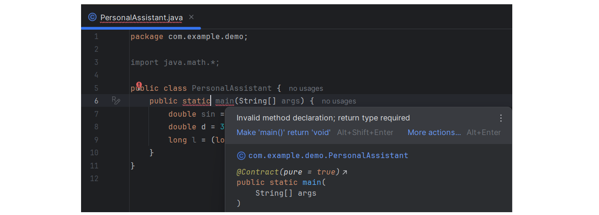
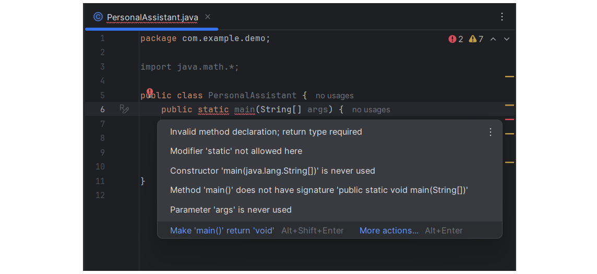
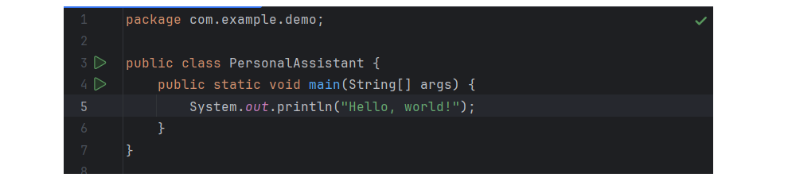
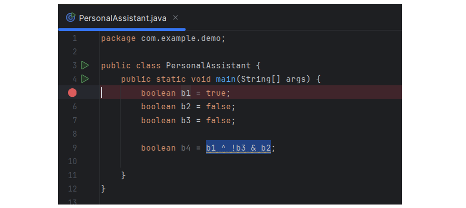
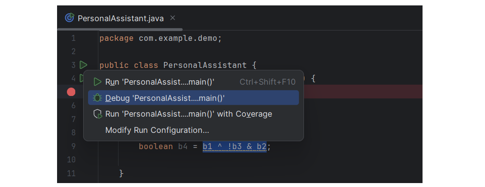
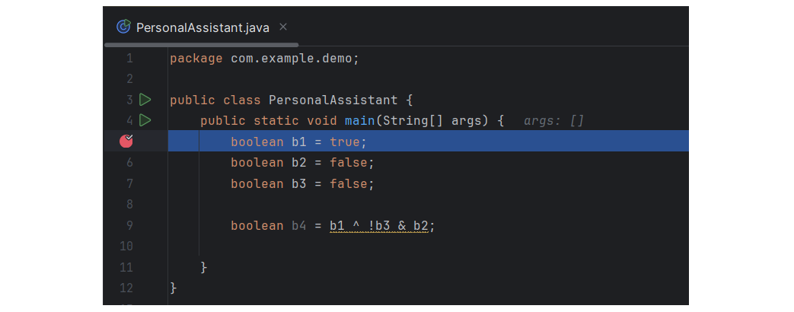
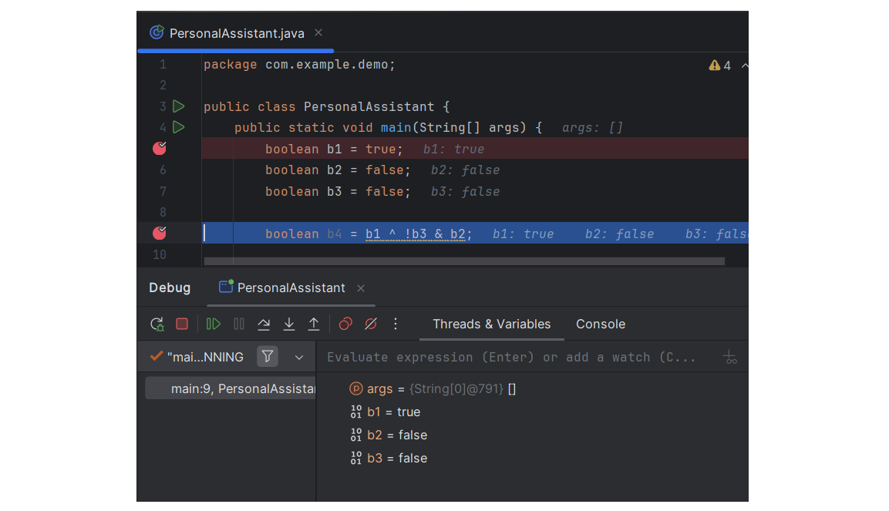
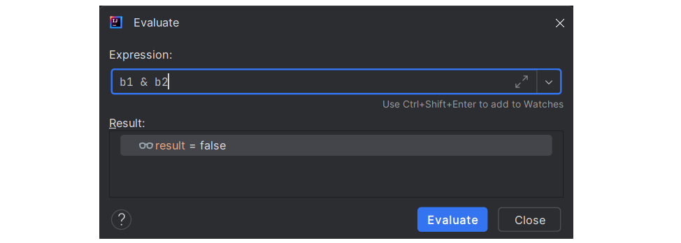

# 异常处理

## 简介

程序不可避免的存在 bug，例如：

- 对需求的误解
- 软件本身的复杂性
- 编程错误
- 第三方库的错误

在大型程序中完全避免 bug 几乎不可能，但可以减少 bug 数量：

1. **明确目标**：充分理解程序的需求
2. **化整为零**：将程序拆解为一个个小单元，这样既容易读懂也容易理解
3. **编写易读的代码**：遵循编程语言的规范
4. **用边界值测试**：在测试程序时考虑各种特殊情况
5. **编写自动化测试**：编写一些自动化测试，在构建程序时自动检查

要修复 bug，首先得在代码中把它找出来，然后进行修改。定位 bug 的方法：

- 通读代码：试着理解代码在处理输入时具体做了什么
- 使用调试器（debugger）：启动 debugger，观察变量的实时变化以及程序的控制流
- 打印日志：在代码的关键部分打印日志，然后进行分析

## 错误类型

Kotlin 将程序错误分为两类：

- 编译时错误（compile-time error）
- 运行时错误（run-time error）

### 编译时错误

编译时错误指那些导致程序无法通过编译的错误。例如：

- 语法错误
- 导入包名错误
- 调用不存在的方法

编译时错误示例：

```kotlin
fun main(args: Aray<String>) {
    printn("Hello!")
}
```

这个程序有两个错误：

- 类名 `Array` 拼写错误
- 函数 `println` 拼写错误

现代 IDE 内置了静态代码分析器，能够标出这些编译时错误，从而避免这类低级错误。

### 运行时错误

运行时错误指程序运行期间发生的错误，即所谓的 bug。运行时错误可以分为两类：

- 逻辑错误
- 未处理的异常：比如除以 0、找不到文件等

相比编译时错误，运行时错误更难处理。常见处理策略包括：

- 调试（debug）
- 编写自动化测试
- 代码审查

## 修复错误

下面介绍如何使用 Intellij IDEA 修复代码错误。

### 智能提示

Intellij IDEA 会提示编译时错误：

- 代码下红色波浪线表示代码有问题，把光标移到高亮代码上，就能看到具体的错误信息。

- 点击红色💡图标，或者按 `Alt+Enter`，可以看到推荐的修复方案。



文件右上角的红色图标，提示文件里错误个数。把鼠标悬停在右侧的红色标记上，可以查看具体的错误信息。



修复完所有问题，右上角就会出现一个绿色的对勾：



### Debugger

**首先设置断点**：点击代码左侧的空白区域就可以设置断点，也可以使用快捷键 `Ctrl+F8`



**启动 debugger**：用 `Shift+F9` 启动 debugger



程序运行到断点就会停下来：



然后按 `F8` 逐行执行代码，一边执行一边看，在 Debug 窗口可以查看所有变量信息：



把鼠标悬停在某个表达式上，也可以看到执行结果：


按 `Alt+F8` 可以打开 `Evaluate` 对话框，在其中可以尝试计算各种表达式：



总结：

- 用灯泡：遇到报错先别慌，先看看自动修复选项
- 用断点：不要用 `println` 看错误，直接用 debugger 暂停程序看看变量值

