# 异常处理

2026-03-03⭐
@author Jiawei Mao
***
## 简介

程序不可避免的存在 bug，例如：

- 对需求的误解
- 软件本身的复杂性
- 编程错误
- 第三方库的错误

在大型程序中完全避免 bug 几乎不可能，但我们可以减少 bug：

1. **明确目标**：充分理解程序的需求
2. **化整为零**：将程序拆解为一个个小单元，这样既容易读懂也容易理解
3. **编写易读的代码**：遵循编程语言的规范
4. **用边界值测试**：在测试程序时考虑各种特殊情况
5. **编写自动化测试**：编写自动化测试，在构建程序时自动检查

要修复 bug，首先得在代码中把它找出来，然后修改。定位 bug 的方法包括：

- 通读代码：试着理解代码在处理输入时具体做了什么
- 使用调试器（debugger）：启动 debugger，观察变量的实时变化以及程序的控制流
- 打印日志：在代码的关键部分打印日志，然后进行分析

## 错误类型

Kotlin 将程序错误分为两类：

- 编译时错误（compile-time error）
- 运行时错误（run-time error）

### 编译时错误

编译时错误指那些导致程序无法通过编译的错误。例如：

- 语法错误
- 导入包名错误
- 调用不存在的方法

编译时错误示例：

```kotlin
fun main(args: Aray<String>) {
    printn("Hello!")
}
```

这个程序有两个错误：

- 类名 `Array` 拼写错误
- 函数 `println` 拼写错误

现代 IDE 内置了静态代码分析器，能够标出这些编译时错误，从而避免这类低级错误。

### 运行时错误

运行时错误指程序运行期间发生的错误，即所谓的 bug。运行时错误可以分为两类：

- 逻辑错误
- 未处理的异常：比如除以 0、找不到文件等

相比编译时错误，运行时错误更难处理。常见处理策略包括：

- 调试（debug）
- 编写自动化测试
- 代码审查

## 修复错误

下面介绍如何使用 Intellij IDEA 修复代码错误。

### 智能提示

Intellij IDEA 会提示编译时错误：

- 代码下红色波浪线表示代码有问题，把光标移到高亮代码上，就能看到具体的错误信息。

- 点击红色💡图标，或者按 `Alt+Enter`，可以看到推荐的修复方案。

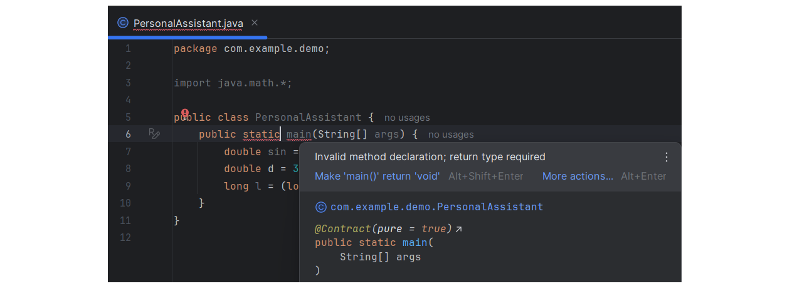

文件右上角的红色图标，提示文件里错误个数。把鼠标悬停在右侧的红色标记上，可以查看具体的错误信息。

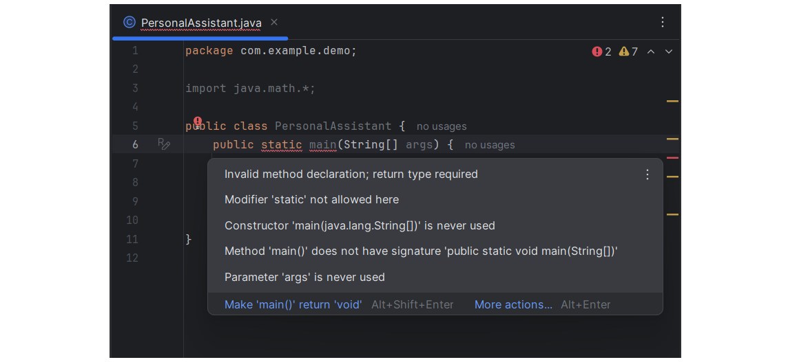

修复完所有问题，右上角就会出现一个绿色的对勾：

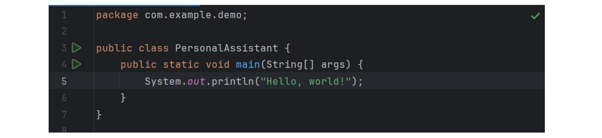

### Debugger

**首先设置断点**：点击代码左侧的空白区域就可以设置断点，也可以使用快捷键 `Ctrl+F8`

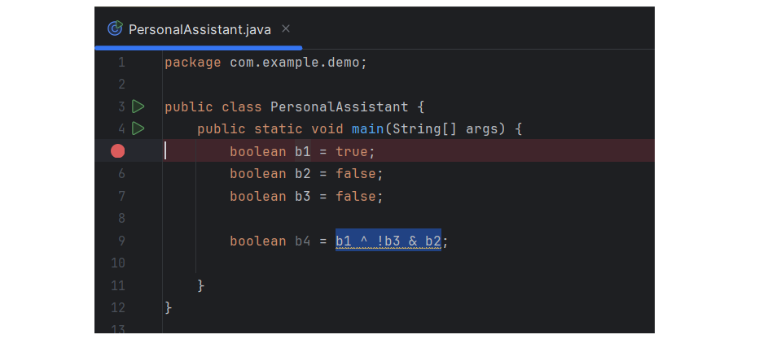

**启动 debugger**：用 `Shift+F9` 启动 debugger

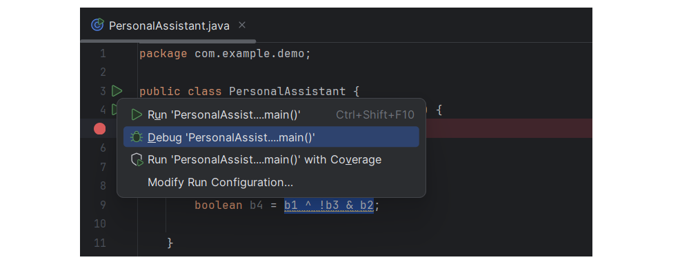

程序运行到断点就会停下来：

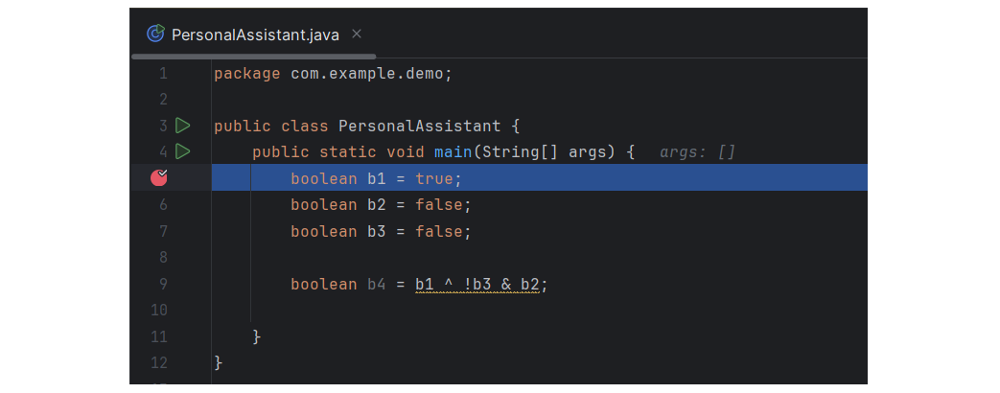

然后按 `F8` 逐行执行代码，一边执行一边看，在 Debug 窗口可以查看所有变量信息：

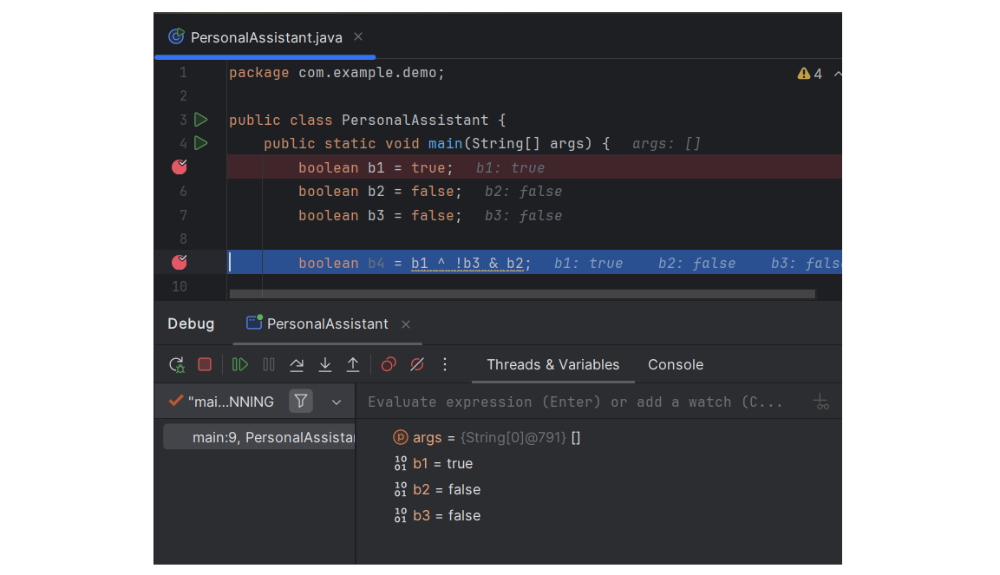

把鼠标悬停在某个表达式上，也可以看到执行结果：

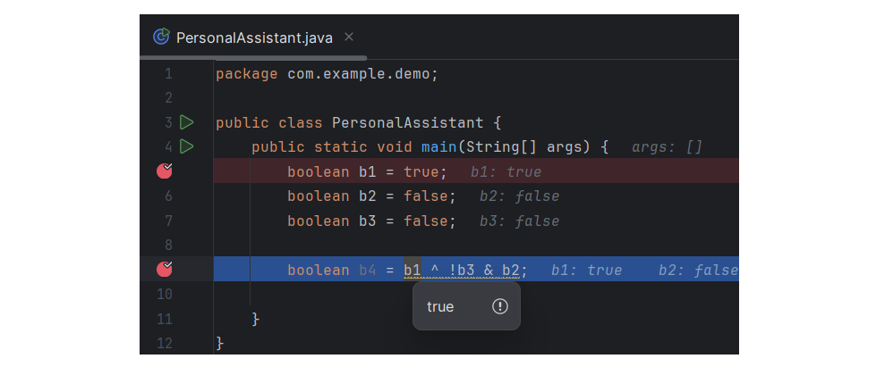

按 `Alt+F8` 可以打开 `Evaluate` 对话框，在其中可以尝试计算各种表达式：

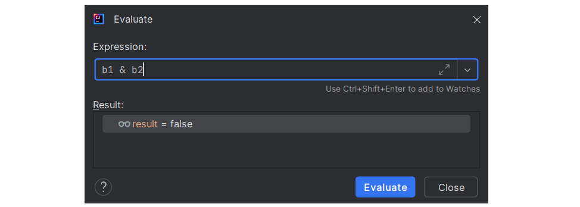

总结：

- 用灯泡：遇到报错先别慌，先看看自动修复选项
- 用断点：不要用 `println` 看错误，直接用 debugger 暂停程序查看变量值

## Exception

在程序运行期间发生的错误称为异常（Exception），例如：

```kotlin
fun readNextInt(): Int {
    return readln().toInt()
}

fun runIncrementer() {
    val increment = 1 + readNextInt()
    println(increment)
}

fun main() {
    runIncrementer()
}
```

`readNextInt()` 从标准输入读取一个整数，如果用户输入的不是整数，`toInt()` 就会失败。假设用户输入：

```sh
> Hi :)
```

此时就会发生异常，程序直接崩溃，输出如下：

```sh
Exception in thread "main" java.lang.NumberFormatException: For input string: "Hi :)"
	at java.base/java.lang.NumberFormatException.forInputString(NumberFormatException.java:67)
	at java.base/java.lang.Integer.parseInt(Integer.java:565)
	at java.base/java.lang.Integer.parseInt(Integer.java:662)
	at HelloWorldKt.readNextInt(HelloWorld.kt:2)
	at HelloWorldKt.runIncrementer(HelloWorld.kt:6)
	at HelloWorldKt.main(HelloWorld.kt:11)
	at HelloWorldKt.main(HelloWorld.kt)
```

即在第二行的 `readNextInt` 函数中，触发了 `NumberFormatException`。

> [!TIP]
>
> **什么是异常？**
>
> 代码中的有些问题不会阻止程序开始运行，当时，当程序运行包含异常的错误代码时，它就会崩溃。**异常**在程序**执行期间**发生，而**语法错误**是在程序**编译期间**发生。
>
> 引发异常的原因多种多样，比如无效的算术运算，或者像上例那样的错误输入。这些错误表明程序的某些行为与预期不符，因此你需要验证输入的数据，或改变处理数据的方式。

### 除以 0

下面用一个典型的算术运算错误演示异常。假设你买了几盒牛奶，记为 `amount`，花了 `total` 元。计算每盒牛奶的价格：

```kotlin
fun itemPrice(total: Int, amount: Int): Int {
    return total / amount
}
```

如果调用该函数时，数量 `amount` 为 0，分母为 0，典型的算术错误：

```kotlin
Exception in thread "main" java.lang.ArithmeticException: / by zero
	at HelloWorldKt.itemPrice(HelloWorld.kt:2)
	at HelloWorldKt.main(HelloWorld.kt:6)
	at HelloWorldKt.main(HelloWorld.kt)
```

预防这个错误非常简单：

```kotlin
fun itemPrice(total: Int, amount: Int): Int {
    if (amount == 0) {
        println("Division by zero")
        return 0
    }
    return total / amount
}
```

> [!TIP]
>
> 这些异常可以通过增加一些数据验证进行预防，多考虑边界条件。

## 异常的类型结构

Kotlin 为各种不同的意外情况准备了专门的异常类型，这些类型共同构成了一套完整的类型分层体系（继承树）。

Kotlin 中的类型按照**子类**（subtype）和**超类**（supertype）定义类型关系。子类型会从超类型继承通用的特征和行为，从逻辑上讲，超类型定义 了所有子类型需要遵循的共有特征与行为规则的类型。

下图是简化的异常类型分层结构：

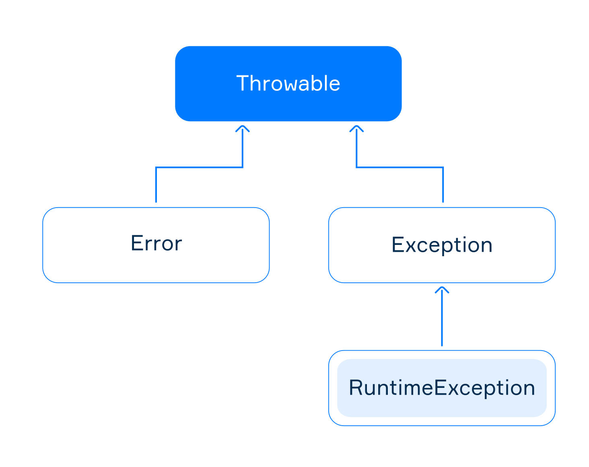

`Throwable` 是所有异常的基类，是整个体系的根节点，并提供了一套处理异常的实用方法。`Throwable` 有两个直接子类：

- `Error` - 代表严重的系统错误（如内存溢出），应用程序通常不需要处理这类错误
- `Exception` - 这是需要重点关注的，开发应用时，需要捕获和处理这些异常

> [!TIP]
>
> 子类和超类是相对概念，例如，`Exception` 既是 `Throwable` 的子类，也是 `RuntimeException` 的超类。

### RuntimeException

`RuntimeException` 是 `Exception` 的一种特殊子类型，通常是由代码中检查不足引起的，可以通过编程手段预防。`RuntimeException` 的常见子类：

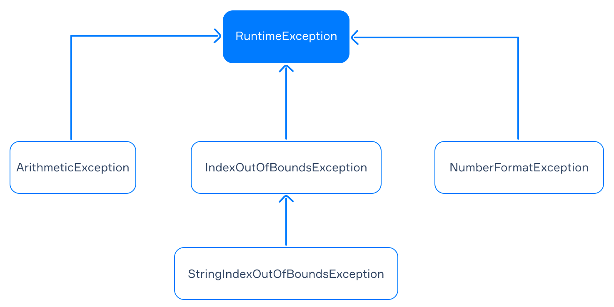

下面演示这几种常见 `RuntimeException`。

### ArithmeticException

`ArithmeticException` 是一种 `RuntimeException`，当代码执行错误的算术运算就会抛出该异常。例如：

```kotlin
val example = 2 / 0 // throws ArithmeticException
```

因为除以 0 是不对的，所以这行代码会抛出 `ArithmeticException`，程序因此会中断。

### NumberFormatException

在计算过程中还可以遇到 `NumberFormatException`，当某个方法期望输入为数字，但实际输入为其他类型时，就会抛出该异常。例如：

```kotlin
val string = "It's not a number"
val number = string.toInt() // throws NumberFormatException
```

这里尝试将字符串 `"It's not a number"` 转换为整数，显然无法实现，因此会抛出 `NumberFormatException`。

### IndexOutOfBoundsException

访问不存在的索引或抛出 `IndexOutOfBoundsException`。例如，在一个只有 5 个元素的集合中访问第 8 个元素，索引就会越界。

该类型还有更具体的子类型，如专门用于字符串的 `StringIndexOutOfBoundsException`：

```kotlin
val sequence = "string"
println(sequence[10])   // throws StringIndexOutOfBoundsException
```

字符串可以看作一组字符的集合，每个字符对应一个索引。如果访问字符串中不存在索引位置的字符，就会抛出该异常。

## 抛出异常

下面介绍其它异常类型，以及如何预防和抛出异常。例如：

```kotlin
fun calculateSpentMoney(total: Int, itemPrice: Int): Int {
    val amountToBuy = total / itemPrice
    return amountToBuy * itemPrice
}
```

这里假设商品单价为 `itemPrice`，你手头有 `total` 元，该函数计算购买最大数量的商品会花费多少钱。例如，烧饼单价 2 元，你手头共有 37 元，该函数会返回 36.

这里有个问题，如果商品免费，比如试吃？该函数没有考虑商品免费的情况，调用 `calculateSpentMoney(37, 0)` 就会抛出 `ArithmeticException`。

**修复异常**

预先确定可能出问题的情况，就能预防这类异常的发生。在这里，当商品免费，函数应返回 0，只需添加一个条件判断就能处理该情况：

```kotlin
fun calculateSpentMoney(total: Int, itemPrice: Int): Int {
    if (itemPrice == 0) {
        return 0
    }
    val amountToBuy = total / itemPrice
    return amountToBuy * itemPrice
}
```

提前判断边界情况，是预防代码崩溃的常用手段。

**抛出异常**

对上例，当输入为负数，此时函数不会崩溃，但返回的结果毫无意义：

- 你手头的现金总额不会为负数
- 商品单价为负数更没意义

这两种情况，函数都无法返回合理的结果，此时主要抛出异常更合适。在 Kotlin 中可以用 `throw` 关键字抛出异常：

```kotlin
fun calculateSpentMoney(total: Int, itemPrice: Int): Int {
    if (total < 0) {
        throw Exception("Total can't be negative")
    }
    if (itemPrice < 0) {
        throw Exception("Item price can't be negative")
    }
    if (itemPrice == 0) {
        return 0
    }
    val amountToBuy = total / itemPrice
    return amountToBuy * itemPrice
}
```

如果有人调用 `calculateSpentMoney(-10, 4)`，第一个条件判定为 `true`，程序会终止并抛出附带指定信息的异常。

当抛出异常时，返回类型为 `Nothing`：

```kotlin
fun makeAnException(): Nothing {
    throw Exception("I'm an exception!")
}
```

## 数组异常

在处理数组时，可能抛出多种类型的异常。

### NullPointerException

数组为引用类型，所以其变量值可以为 `null`，因此可能导致空指针异常（NPE）：

```kotlin
val numbers: IntArray? = null
val size = numbers!!.size // It throws NPE
```

这类异常很常见，可以通过添加额外校验来规避：

```kotlin
val size = if (numbers == null) 0 else numbers.size
```

### NegativeArraySizeException

创建一个长度为负数的数组，代码可以编译成功，但会抛出运行时异常 `NegativeArraySizeException`：

```kotlin
val negSize = -1
val numbers = IntArray(negSize) // an exception here
```

遇到这种异常的概率很低，只需要注意不用负数设置数组长度。

### ArrayIndexOutOfBoundsException

访问数组中不存在的元素抛出该异常，在数组操作中很常见。

```kotlin
val array = intArrayOf(1, 2, 3) // an array of ints
val n1 = array[2] // n1 is 3
val n2 = array[3] // Exception
```

这里最后一行会抛出 `ArrayIndexOutOfBoundsException`，因为该数组最后一个有效索引值为 2.

用负数索引抛出相同异常：

```kotlin
array[0];  // OK
array[-1]; // Exception
```

通过检查索引是否在 `[0,size-1]` 范围可以避免该异常。示例：

```kotlin
fun main() {
    val hardCodedArray = intArrayOf(3, 2, 4, 5, 1)
    val index = readln().toInt()
    if (index < 0 || index > hardCodedArray.size - 1) {
        println("The index is out of bounds.")
    } else {
        println(hardCodedArray[index])
    }
}
```

### StringIndexOutOfBoundsException

字符串可以看作字符数组，这是专门为字符串设计的字符串索引越界异常。

```kotlin
val string = "string"
val ch = string[6] // Exception StringIndexOutOfBoundsException
```

也是通过提前检查索引范围来规避：

```kotlin
fun main() {

    val string = "string"
    val index = readln().toInt()
    if (index <= string.length - 1)
        println(string[index])
    else
        println("The check works, there is no exception.")
}
```

Kotlin 还有很多预定义异常类型，具体可以参考 Kotlin 标准库：https://kotlinlang.org/api/core/kotlin-stdlib/

## try-catch

异常会中断程序的执行，为了避免该情况，我们需要编写代码来处理异常。下面介绍处理异常的两个关键字：`try` 和 `catch`。

下面是用于处理异常的 `try-catch` 模板：

```kotlin
try {
    // 可能抛出异常的代码
} catch (e: SomeException) {
    // 用于处理异常的代码
}
```

`try` 代码块用于包裹可能抛出异常的代码。该代码块可以包含任意行代码，包括方法调用。

`catch` 代码块是针对指定异常类型及其所有子类型的处理方法。当 `try` 代码块中发生对应类型的异常，该代码块会执行。

下面演示使用 `try-catch` 的执行流程：

```kotlin
println("Before the try-catch block") // 打印
try {
    println("Inside the try block before an exception") // 打印
    println(2 / 0) // 抛出 ArithmeticException
    println("Inside the try block after the exception") // 不打印
} catch (e: ArithmeticException) {
    println("Division by zero!") // 打印
}

println("After the try-catch block") // 打印
```

```
Before the try-catch block
Inside the try block before an exception
Division by zero!
After the try-catch block
```

这里不会打印 `"Inside the try block after the exception"`，因为 `ArithmeticException` 异常中断了程序的正常执行。取而代之，执行`catch` 代码块中的打印语句。`catch` 执行完毕后，继续执行后续语句。

若将 `catch` 语句中的 `ArithmeticException` 替换为 `Exception` 或 `RuntimeException`，执行流程不会变。但是如果换成其他类型，如 `NumberFormatException`，由于异常类型不匹配，程序失败并中断。

### 异常信息

`catch` 捕获的异常，可以通过 `message` 属性查询异常信息：

```kotlin
try {
    val d = (2 / 0).toDouble()
} catch (e: Exception) {
    println(e.message)
}
```

```
/ by zero
```

### 捕获多个异常

可以在 `catch` 中捕获多个异常。

- 用所有异常的超类，捕获所有异常类型

```kotlin
try {
    // code that may throw exceptions
} catch (e: Exception) {
    println("Something goes wrong")
}
```

这种方式无法根据发生的异常类型执行不同操作。

- 分别捕获

```kotlin
try {
    // code that throws exceptions
} catch (e: IOException) {
    // handling the IOException and its subtypes   
} catch (e: Exception) {
    // handling the Exception and its subtypes
}
```

可以根据需要添加任意多个 `catch` 代码块。当 `try` 代码块中发生异常，Kotlin 会根据异常类型从上到下匹配并执行第一个合适的 `catch` 代码块。

> [!TIP]
>
> **何时处理异常**
>
> 从技术上讲，可以在发生异常的方法中处理异常，也可以在调用该方法的上层方法中处理。**处理异常的最佳方法**是：在拥有足够信息，能根据该异常做出正确处理的方法中处理。

## try-catch-finally

除了 `try-catch`，还可以添加 `finally` 代码块。无论 `try` 代码块是否发生异常，`finally` 包含的代码都会执行。

```kotlin
try {
    // code that may throw an exception
}
catch (e: Exception) {
    // exception handler
}
finally {
    // code is always executed
}
```

`finally` 代码块在 `catch` 后执行。

`finally` 主要用于执行一些收尾工作，例如在处理文件时抛出异常，在 `finally` 中关闭文件。

下面演示 `try-catch-finally` 语句的执行顺序：

```kotlin
try {
    println("Inside the try block")
    println(2 / 0) // throws ArithmeticException
}
catch (e: Exception) {
    println("Inside the catch block")
}
finally {
    println("Inside the finally block")
}

println("After the try-catch-finally block")
```

```
Inside the try block
Inside the catch block
Inside the finally block
After the try-catch-finally block
```

如果移除抛出 `ArithmeticException` 异常的代码，`finally` 代码块仍会以在 `try` 代码块执行完毕后执行：

```
Inside the try block
Inside the finally block
After the try-catch-finally block
```

也许你会问，既然可以直接把代码写在 `try-catch` 之后，那为啥还需要 `finally`？例如：

```kotlin
fun main() {
    try {
        val a = 0/0 // throws ArithmeticException
    }
    finally {
        println("End of the try block") // will be executed
    }
    println("End of the program") // will not be printed
}
```

抛出异常后，位于末尾打印 `"End of the program"` 的代码不会执行，而 `finally` 代码块始终会执行。

### 省略 catch

可以只使用 `try-finally`，不要 `catch`：

```kotlin
try {
    // code that may throw an exception
} 
finally {   
    // code will always be executed
}
```

其中，`finally` 会在 `try` 之后立即执行。

所以，在 `try` 后面可以包含任意数量的 `catch` 代码块，也可以完全没有 `catch`，同时，`finally` 代码块也可以省略。但是，`catch` 和 `finally` 至少要有一个。

### try 表达式

与 Java 不同的是，Kotlin 中的 `try` 可以作为表达式使用。即 `try` 可以有返回值：

```kotlin
val number: Int = try { "abc".toInt() } catch (e: NumberFormatException) { 0 }
println(number) // 0
```

在 `try` 中尝试将 `"abc"` 转换为整数，会抛出 `NumberFormatException`，此时 `catch` 代码块执行，因此变量 `number` 值为 0.

`try` 表达式的返回值，要么是 `try` 代码块末尾表达式的值，要么是 `catch` 代码块（可以多个）末尾表达式的值。`finally` 代码块的内容不影响表达式的值。

```kotlin
val number: Int = try { "2a".toInt() } catch (e: NumberFormatException) { 0 }
finally { println("Inside the finally block") }
println(number)
```

```
Inside the finally block
0
```

处理异常的另一种方法是将异常**重新抛给调用方**，例如：

```kotlin
fun test() {
    val result = try {
        countSomething()
    } catch (e: ArithmeticException) {
        throw IllegalStateException(e) // do not forget to deal with it
    }

    // Working with result
}


try {
    test()
} catch (e: IllegalStateException) {
    ...
}
```

### Kotlin 惯例

将 `try-catch` 作为表达式使用，是 Kotlin 处理异常的惯用方式。可以直接获得结果，非常方便，下面将这种写法与另一种不够简洁的写法进行对比：

```kotlin
val string = "abc"
val number = try {
    string.toInt()
} catch (e: NumberFormatException) {
    -1
}

...

val string = "abc"
var number = 0 // try to avoid var if possible
try {
    number = string.toInt()
} catch (e: NumberFormatException) {
    number = -1
}
```

第二种写法需要将变量声明为 `var`。

> [!TIP]
>
> Kotlin 提供了许多语法糖，一种功能有多种实现方式，
>
> Kotlin 推荐了 30 多种惯用写法：https://kotlinlang.org/docs/idioms.html

## 日志

日志是在应用程序运行过程中记录的信息，能够反映软件各类事件的信息。

日志除了描述所发生的事件，通常还包括事件发生的时间、描述信息以及严重级别。这些事件可能由用户触发，也可能由系统触发。日志有多种用处：

1. 排查程序问题。如果程序出现异常，可以在日志中找到错误发生的时间和位置，从而更容易调试
2. 追踪谁在使用程序。例如，网站可以通过日志查看谁发送了请求
3. 监控运行状况，随时掌握程序的运行状态和性能

### when, what, how

关于日志，我们应该在什么时候记录、记录什么以及如何记录？

如前所述，日志可用于排查故障、审计追踪、监控性能以及统计。记录哪些内容，取决于具体的应用程序。如论如何，我们至少能够通过日志了解程序的执行路径。另外要避免过度记录日志，减少资源开销。例如，没有必要记录每个方法的开始与结束，以及它们的参数，因为这些信息很容易追踪。

日志主要覆盖：服务器问题、数据库问题、网络问题、非预期用户输入导致的错误、配置参数值等。

在日志中提供上下文信息也非常重要，程序的成功与否往往取决于用户输入，因此必要时应将这些信息写入日志。例如，对用户进行身份验证时，记录输入的用户名。在并发环境中，记录线程名。

### 日志级别

通用日志级别：Debug, Info, Warn, Error, Fatal (严重性从低到高)。

- **Debug** - 用于调试，告诉我们程序在做什么，得到什么结果
- **Info** - 用于记录程序的重要信息，如服务启动、停止、配置信息等
- **Warn** - 应该程序故障的最低级别，但不影响程序继续执行
- **Error** - 更严重的问题，通常会影响程序结果，但不会终止程序。例如，提示用户无法登录，因为数据库暂时不可用
- **Fatal** - 致命错误导致程序终止。这类信息表示程序崩溃，开发人员可以根据故障发生的时间和环境修复问题

### 日志格式

常用日志格式：

```
[date time][log level][message]
```

示例：

```
[2021-02-02 15:00:00] [INFO] User 'demo' has registered
```

还有一些更复杂的日志格式，在其中包含线程、输入日志代码在哪个文件的第几行等信息，具体可参考 [Common Log Format](https://en.wikipedia.org/wiki/Common_Log_Format)。
