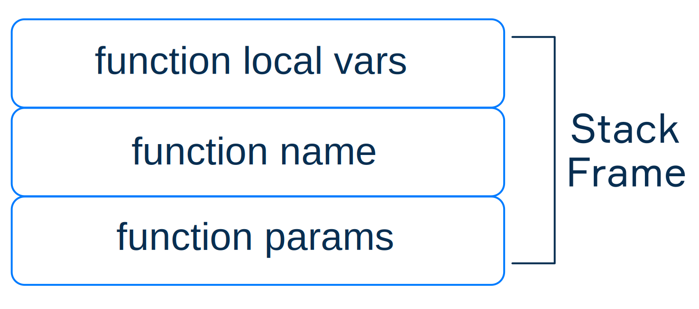
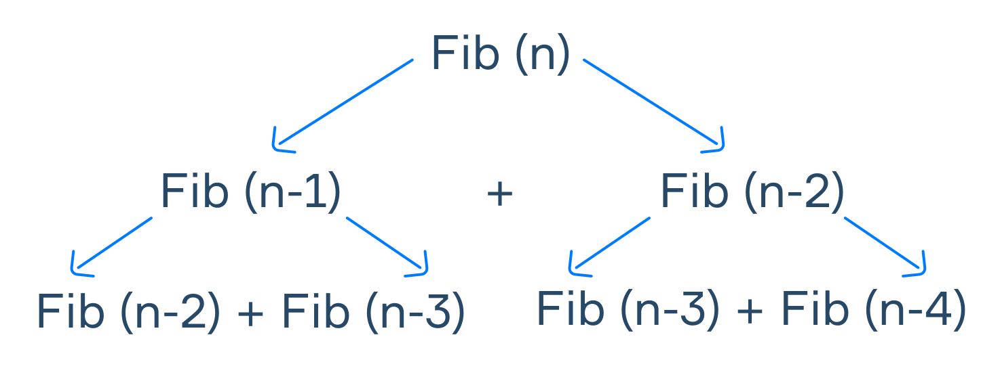
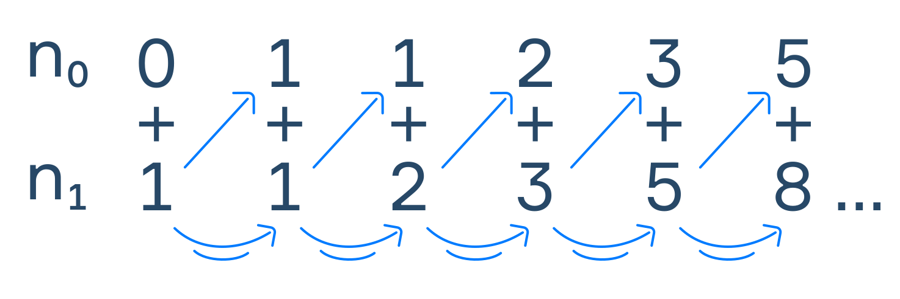
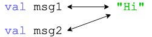

# 函数

2026-02-07⭐
@author Jiawei Mao
***

## 声明函数

在 Kotlin 中，函数是代码的基础，用于定义可重复使用的代码块。

### 基本语法

声明函数的语法：

```kotlin
fun functionName(p1: Type1, p2: Type2, ...): ReturnType {
    // body
    return result
}
```

函数组成：

- `fun` 关键字
- 函数名称，其命名规范与变量名称一样
- 参数放在括号中，用逗号分隔
- 每个参数包含名称和类型，两者用冒号分隔
- 返回值类型，可省略
- 函数主体

### 定义一个简单函数

声明一个计算整数加和的函数：

```kotlin
fun sum(a: Int, b: Int): Int {
    val result = a + b
    return result
}

fun main() {
    val result1 = sum(2, 5)
    println(result1) // 7

    val result2 = sum(result1, 4)
    println(result2) // 11
}
```

使用函数名称 `sum` 调用该函数，传入参数 `2` 和 `5`，这两个值被赋值给参数 `a` 和 `b`。`sum` 返回 `result` 的值，其类型与函数声明的返回值类型 `Int` 一致。第二次调用类似，只是将 `result1` 的值作为参数传递给 `a`。

### 函数参数

参数为函数提供输入数据：

- 函数可以声明**一个或多个参数**
- 这些参数的类型可以相同，也可以不同
- 也可以声明一个完全不带参数的函数
- 函数名后的圆括号为必填项

示例：

```kotlin
/**
 * The function returns its argument
 */
fun identity(a: Int): Int {
    return a
}

/**
 * The function returns the sum of two Ints
 */
fun sum(a: Int, b: Int): Int {
    return a + b
}

/**
 * The function just returns 3
 */
fun get3(): Int {
    return 3
}

fun add3(a: Int): Int {
    return identity(a) + get3()
}

fun main() {
    println(identity(1000)) // 1000
    println(sum(200, 300))  // 500    
    println(get3())         // 3
    println(add3(5))        // 8
}
```

可以看到，可以在 `main` 函数中调用某个参数，也可以其它普通函数中嗲用函数，如 `add3` 所示。

### 返回类型

函数可以返回一个值，或不返回任何值。

若函数要返回某个值，其函数主体内必须包含 `return` 关键字，在其后跟上要返回的结果。

声明不返回任何值的函数，有两种方式：

- 忽略返回类型

```kotlin
/**
 * The function prints the values of a and b
 */
fun printAB(a: Int, b: Int) {
    println(a)
    println(b)
}
```

- 使用特殊的 `Unit` 类型作为返回类型

```kotlin
/**
 * The function prints the sum of a and b
 */
fun printSum(a: Int, b: Int): Unit {
    println(a + b)
}
```

### 函数主体

- 在函数主体中可以编写任何语句。除了参数，还可以在函数内声明只在函数内部使用的变量。

例如，下面这个函数提取一个数字的随后一位：

```kotlin
fun extractLastDigit(number: Int): Int {
    val lastDigit = number % 10
    return lastDigit
}
```

- 可以省略多余的变量，简化代码：

```kotlin
fun extractLastDigit(number: Int): Int {
    return number % 10
}
```

- 在函数内可以执行任意操作。例如，检查一个数字是否为正数：

```kotlin
fun isPositive(number: Int): Boolean {
    return number > 0
}
```

`isPositive` 函数接收一个整数类型参数，返回一个 `Boolean` 值。

- `return` 语句之后的代码不会被执行

```kotlin
/**
 * It returns "hello"
 */
fun getGreeting(): String {
    return "hello"   // Ends the function
    println("hello") // Will not be executed
}
```

### 单表达式函数

- 如果函数很简单，只有一个表达式，此时可以省略大括号：

```kotlin
fun sum(a: Int, b: Int): Int = a + b

fun sayHello(): Unit = println("Hello")

fun isPositive(number: Int): Boolean = number > 0
```

- 也可以不指定返回值类型，因为编译器可以自动推断

```kotlin
fun sum(a: Int, b: Int) = a + b // Int

fun sayHello() = println("Hello") // Unit

fun isPositive(number: Int) = number > 0 // Boolean
```

## 函数式分解

将复杂程序拆解为多个函数的编程方法，称为**函数式分解**（functional decomposition）。

### 解决复杂任务

将一个复杂任务拆解为若干个子问题，其实很直观。

例如，假设有一个智能家居 app，它用于远程控制家居设备，它有三项操作：开启或关闭音乐、开关灯、开关门。

这款 app 的通用操作流程，可以拆解为以下步骤：

1. 解析输入数据（用户输入的密码）
2. 验证密码是否正确
3. 询问用户的操作需求
4. 若支持该操作，则执行相应操作

直接在 `main` 中定义整个流程：

```kotlin
fun main() {
    // ...
    val password = "76543210"
    var speakersState: String
    var lampState: String
    var doorState: String
    // ...

    // reading the password
    println("Enter password: ")
    val passwordInput = readln()

    // checking if the password is correct
    if (passwordInput != password) {
        println("Incorrect password!")
    } else {
        // asking the user what they want to do
        println("Choose the object: 1 – speakers, 2 – lamp, 3 – door")
        val action = readln()

        when (action) {
            "1" -> {
                // asking the user about the speakers
                when (speakersState) {
                    "on" -> {
                        // ...
                    }
                    "off" -> {
                        // ...
                    }
                    else -> {
                        // ...
                    }
                }
            }
            "2" -> {
                // asking the user about the lights...
            }
            "3" -> {
                // asking the user about the door...
            }
            else -> {
                // ...
            }
        }
    }
}
```

虽然进行了精简，但这段代码看起来依然臃肿。它能解决当前问题，但后续调整或扩展功能会比较麻烦。

例如，支持多 用户使用，或者增加操作数量、提升操作的复杂度等。为了让这段代码适用性更强、更灵活，可以采用函数式分解。

### 将程序分解为函数

**函数式分解**指把一个问题拆解为若干函数的过程。每个函数负责一项特定任务，按顺序执行函数，就能得到所需结果。在分析问题时，需要找出哪些会被多次重复执行，或者可以独立执行的操作。通过这种提炼出的函数，更容易阅读、理解、复用、测试。

针对上例，可以使用一个函数控制音乐、另一个函数开关等、再用一个函数控制门锁。控制音乐的函数 `controlMusic()` 如下，`controlLight()` 和 `controlDoor()` 的定义类似：

```kotlin
// turns the music on and off
fun controlMusic() {
    println("on/off?")
    val tumbler = readln()
    when (tumbler) {
        "on" -> println("The music is on")
        "off" -> println("The music is off")
        else -> println("Invalid operation")
    }
}
```

再定义一个函数验证密码：

```kotlin
// verifies the password and gives the access to Smart home actions if the password is correct
fun accessSmartHome() {
    val password = "76543210"
    print("Enter password: ")
    val passwordInput = readln()
    if (passwordInput == password)
        chooseAction()
    else
        println("Incorrect password!")
}
```

还定义一个带操作菜单的函数 `chooseAction()`，用户可以在菜单中选择需要执行的操作。该函数会询问用户想要进行的操作，并调用对应的函数来执行。

最后，在 `main` 函数中执行经过分解的程序：

```kotlin
fun main() {
    accessSmartHome()
}
```

### 新增功能

如果想要添加一项新功能，只需定义对应的函数即可。例如，新增一款智能设备电水壶。可以编写一个函数来控制它的开关。然后修改 `chooseAction()` 函数，为其添加一个新的操作选项。

```kotlin
// controls electric kettle
fun controlKettle() {
    // ...
}

// main menu for choosing the action
fun chooseAction() {
    // ...

    // adding new action 4
    println("Choose the object: 1 – speakers, 2 – lamp, 3 – door, 4 – kettle")
    // ...
        "4" -> controlKettle()
    // ...
}
```

将各个功能封装在独立的函数中，使我们能够轻松对这些组件进行测试。使得程序的维护更便捷。

## 默认参数

Kotlin 支持在声明函数时为参数指定默认值。在调用该函数时，可以省略带默认值的参数，也可以指定新的参数值。

下面是一个名为 `printLine` 的函数，它包含两个参数：

1. 参数一定义一行文本
2. 参数二定义结束这行文本的字符

这两个参数都赋予了默认值，分别为空字符串和换行符。

```kotlin
fun printLine(line: String = "", end: String = "\n") = print("$line$end")
```

在参数类型后面使用 `=` 为参数赋值。

使用示例：

```kotlin
fun printLine(line: String = "", end: String = "\n") = print("$line$end")

fun main() {
    printLine("Hello, Kotlin", "!!!") // prints "Hello, Kotlin!!!"
    printLine("Kotlin") // prints "Kotlin" with an ending newline
    printLine() // prints an empty line like println()
}
```

第一次调用传入两个参数，`"Hello, Kotlin"` 和 `"!!!"`；第二次调用，只传入第一个参数 `"Kotlin"`，第二个参数取默认值 `"\n"`；第三次调用没有传入任何参数，两个参数都使用默认值。

输出：

```kotlin
Hello, Kotlin!!!Kotlin 
```

### 混合使用默认参数与普通参数

在声明函数时可以混合使用默认参数与普通参数。例如:

```kotlin
fun findMax(n1: Int, n2: Int, absolute: Boolean = false): Int {
    val v1: Int
    val v2: Int

    if (absolute) {
        v1 = Math.abs(n1)
        v2 = Math.abs(n2)
    } else {
        v1 = n1
        v2 = n2
    }

    return if (v1 > v2) n1 else n2
}

fun main() {
    println(findMax(11, 15)) // 15
    println(findMax(11, 15, true)) // 15
    println(findMax(-4, -9)) // -4
    println(findMax(-4, -9, true)) // -9
}
```

`findMax` 函数内声明了两个变量。它们会根据 `absolute` 参数存储传入参数的绝对值或原始值。函数最后一行比较两个临时变量，并返回对应传入参数的值。

 ### 惯用写法

默认函数参数是 Kotlin 惯用写法的一部分。在编写复杂函数时使用默认参数非常有用。

```kotlin
fun foo(a: Int = 0, b: String = "") { 

}
```

## 命名参数

在调用包含多个参数的函数时，可以通过**参数名称**传入实参。当函数包含大量参数时，这种方式能够提高代码的可读性，而且可以调整调用时实参的顺序。

### 提高代码可读性

假设一位售票员卖电影票，单日票价保持不变。现在需要计算这位售票员在工作日结束时有多少钱。函数如下：

```kotlin
fun calcEndDayAmount(startAmount: Int, ticketPrice: Int, soldTickets: Int) =
        startAmount + ticketPrice * soldTickets
```

- `startAmount` 收银台初始现金
- `ticketPrice` 为票价
- `soldTickets` 为当日卖出的电影票数量

这是一个常规函数，可以按以下方式调用：

```kotlin
val amount = calcEndDayAmount(1000, 10, 500)  // 6000
```

这完全没问题，但是参数的含义不是很明确。Kotlin 支持用命名实参调用：

```kotlin
val amount = calcEndDayAmount(
    startAmount = 1000,
    ticketPrice = 10,
    soldTickets = 500
)  // 6000
```

这更容易理解。

### 调整实参顺序

命名实参可以调整参数顺序：

```kotlin
val amount = calcEndDayAmount(
    ticketPrice = 10,
    soldTickets = 500,
    startAmount = 1000
)  // 6000
```

### 命名实参和位置实参

在调用函数时可以混用命名参数和位置参数，但要确保命名实参在位置参数后面：

```kotlin
calcEndDayAmount(1000, ticketPrice = 10, soldTickets = 500)  // 6000
```

Kotlin 1.4+ 命名实参可以放在位置参数前面，但要保证参数顺序与函数前面一致：

```kotlin
calcEndDayAmount(ticketPrice = 10, 500, 1000)   // Incorrect invocation!
calcEndDayAmount(startAmount = 1000, 10, 500)   // OK

calcEndDayAmount(soldTickets = 500, ticketPrice = 10, startAmount = 500) // OK
calcEndDayAmount(soldTickets = 500, ticketPrice = 10, 500)  // Incorrect invocation!
```

### 默认参数和命名实参

命名实参可以与默认参数一起使用。默认参数有时会引发歧义，使得 Kotlin 无法判断为哪些参数赋值。

修改上一个函数，为第一个参数指定默认值

```kotlin
fun calcEndDayAmount(startAmount: Int = 0, ticketPrice: Int, soldTickets: Int) =
        startAmount + ticketPrice * soldTickets
```

调用该函数时，采用位置实参只指定后面两个参数不行：

```kotlin
val amount = calcEndDayAmount(10, 500)  // Won't work —
                                        // no value for soldTickets
```

这里 `10` 会赋值给第一个可选参数 `startAmount`。

使用命名参数可以避免该问题：

```kotlin
val amount = calcEndDayAmount(ticketPrice = 10, soldTickets = 500)  // 5000
```

### 命名参数和默认值

函数参数的默认值可以是常量，也可以是其它变量，甚至可以使另一个命名实参或某个函数。例如：

```kotlin
fun sum2(a: Int, b: Int = a) = a + b
 
sum2(1)    // 1 + 1
sum2(2, 3) // 2 + 3
```

以下代码无法运行，因为参数 `b` 没有完成初始化：

```kotlin
fun sum2(a: Int = b, b: Int) = a + b
```

## 调用栈

在编写程序时，经常需要在函数中调用其它函数，计算机如何确定函数的执行顺序，如何在不同函数之间切换执行，又如何判断程序何时执行完毕，这些都通过**调用栈（call stack）**实现。

JVM 通过调用栈确定下一个要执行的函数。调用栈由**栈帧**（stack frame）组成，栈帧存储未执行完毕的函数信息，包括返回地址、参数、局部变量、中间计算结果等。



调用栈遵循**后进先出**（LIFO）规则。当程序执行到一个新号俺叔，会向调用栈添加一个新的栈帧；当函数执行完毕，对应的栈帧就会从调用栈移除。

### 栈帧示例

下面以“输出指定数字的下一个偶数”的程序为例，来解释调用栈的工作过程。

程序：

```kotlin
fun printNextEvenNumber(n: Int) {
    val next = if (n % 2 == 0) n + 2 else n + 1
    println(next)
}

fun main(args: Array<String>) {
    val n = 99
    printNextEvenNumber(n)
}
```

这个程序声明了两个函数：`printNextEvenNumber` 和 `main`。

第一个调用的函数必然是 `main`。每调用一个函数，就会创建一个新的栈帧。`main` 对应的栈帧如下：

1. 函数参数 `args` 被压入栈帧
2. 函数地址（用函数名称 `main` 表示）被压入栈帧，用于记录后续函数调用完成后返回的位置
3. 将局部变量 `n` 压入栈帧

 下图展示了包含 `main` 栈帧的调用栈：


> [!NOTE]
>
> 实际上，栈中只存储参数数组 `args` 的引用，所有引用类型都存储在堆内存中。数值类型 `n` 的值直接存储在栈中。

### 栈与函数执行

接下来调用 `printNextEvenNumber` 函数。此时系统会创建一个新的栈帧。函数参数 `n`，地址 `printNextEvenNumber` 和局部变量 `next` 都被加入这个新栈帧。

此时执行栈中有两个栈帧 `main` 和 `printNextEvenNumber`：


> [!NOTE]
>
> 两个栈帧都有名为 `n` 的变量，但它们不是同一个变量。

接下来执行调用栈顶部函数 `printNextEvenNumber`。执行完毕后，从调用栈移除 `printNextEvenNumber`，然后继续执行 `main` 栈帧。

标准函数 `println` 的工作方式与自定义函数类似，也会创建一个新栈帧，在 `println` 执行完毕后，`printNextEvenNumber` 继续执行。

几乎所有 Kotlin 和 Java 程序都以这种方式运行。当调用栈为空时，程序执行终止。

### Stack overflow

执行栈可以调用的函数个数取决于为栈分配的内存大小。当栈中包含过多栈帧时，就会发生栈溢出（stack overflow），进而抛出 `StackOverflowError` 异常，程序终止。

通过 `-Xss` 可以设置程序的栈大小：

```sh
kotlin YourProgramName -Xss256k
```

### 总结

- 调用栈是一个后进先出的数据结构， JVM 使用调用栈确定函数的执行顺序，并访问函数相关信息
- 调用栈由栈帧组成：栈帧存放已被调用当尚未执行完毕的函数信息
- 调用栈包含过多栈帧可能导致 `StackOverflowErrror`

## scope

每个变量都有一个作用域（scope），作用域定义能够使用该变量的代码范围。作用域可以是整个程序，某个函数或某个文件。

### 分支结构

下面先介绍在分支结构中的作用域。示例：

```kotlin
val outer = 10
if (outer > 0) {
    val inner = 10
    print(inner)
} else {
    // 超出 if block 
    print(outer)
    print(inner)  // 无法访问 inner
}
// 超出 if-else 表达式
print(outer)
print(inner)  // 无法访问 inner
```

在 `if` 代码块（block）内部声明了 `inner` 变量，该变量的作用域就是整个 `if` block，即大括号内部。如果在 `else` block 或整个 `if-else` 表达式外面访问 `inner` 变量，就会报错。同样，如果在 `else` block 内部声明某个变量，在 `if-else` 表达式之外放问它，也会出现同样的错误。

但 `outer` 变量不存在该问题：它在 `if-else` 表达式外面声明，整个 `if-else` 都处于 `outer` 的作用域内。

### 循环中的变量

下面看看循环中的作用域。下面是一个 while 循环：

```kotlin
var outer = 5
while (outer < 10) {
    var inner = 10
    inner *= 2
    print(inner)
    outer++
}  // prints 2020202020

// outside the while loop
print(inner)  // Unresolved reference: inner
```

在循环内部初始化 `inner` 变量，它的作用域也严格限定在循环内部。可以看到，每次新的循环开始，`inner` 都会重新初始化，因此最终打印 `2020202020`。

循环外部声明的 `outer` 变量，在这段代码任何位置都能访问。

### 函数中的变量

最后介绍函数中变量的作用域。示例：

```kotlin
fun localScope() {
    val identifier = "Variable in the function localScope()"
    println(identifier)  // prints "Variable in the function localScope()"
}

fun main() {
    val identifier = "Variable in fun main()"
    localScope()
    println(identifier)  // prints "Variable in fun main()"
}
```

在 `localScope()` 函数中声明了 `identifier` 变量。在 `main()` 函数中也声明了一个同名变量。

在函数内部声明的变量，其作用域就是函数本身。

### 作用域的交互

程序的作用域通常是分层的。一个作用域包含在另一个作用域中，构成一个分层结构。示例：

```kotlin
var id = 5
if (true) {
    id = 6
    var id = 10
    println(id)  // prints 10
}
println(id)  // prints 6
```

解释：

1. 第一行，声明变量 `id` 并赋值 5
2. 声明 `if` block
3. 在 `if` block 中，为 `id` 变量赋值 6.`if` 作用域内未声明过这个变量，但在 `if` block 外层作用域已经声明过，因此外层的 `id` 变量被赋值 6
4. 在 `if` block 内声明一个新变量 `id`，并赋值为 10。这是一个仅存于当前 `if` 作用域的新变量
5. 在 `if` block 内调用 `println(id)`，程序会首先在 `if` block 作用域查找该名称的变量。它在当前作用域找到目标变量，其值为 10，就不会关注其它其它作用域了。因此最终输出 10
6. 跳出 `if` 并调用 `println(id)`，程序再次查找名为 `id` 的变量。在当前的外层作用域，该变量值为 6，因此打印 6

总结：

- 如果作用域 **B** 在作用域 **A** 内部，那么可以直接在作用域 B 中使用作用域 A 的识别符
- 在作用域 B 中定义的任何识别符，在作用域 A 中不可见
- 被调用的识别符，会先在当前作用域查找，然后再向外层找

### 顶层变量

Kotlin 文件的顶层也是一个作用域，是包含整个文件的作用域。程序中的变量根据作用域可以分为**顶层变量**和局部变量。顶层变量在类和函数之外定义，其作用域是整个文件；而局部变量在定义时创建，如函数内部。

示例，`top` 为顶层变量：

```kotlin
val top = "Top-level variable"
fun localScope() {
    println(top) 
}

fun main() {
    println(top)  // prints "Top-level variable"
    localScope()  // prints "Top-level variable"
}
```

可以看到，顶层变量可以在文件的任意位置访问。这是**定义常量**的一种方式：

```kotlin
const val CONSTANT = 0 // constant value definition

fun main() {
    // ...
}
```

**使用规则**：优先使用局部变量。过多使用顶层变量会降低代码的可读性，还有可能引发难以排查的错误。

### 作用域总结

1. 变量在哪声明，作用域就在哪（代码块、函数、循环、if）
2. 内层能用外层，外层不能用内层
3. 找变量：先向前，再往上（就近原则）
4. 内层同名变量会遮蔽外层（优先内层）
5. 变量生命周期：除了作用域就失效
6. 顶层变量：整个文件可见，尽量少用，优先使用局部变量

## 递归基础

递归，就是函数调用自身。它包含一个终止条件，以及一套将其它情况逐步简化为终止条件的规则。实现这一逻辑的函数称为递归函数。例如：

```kotlin
fun printStars(n: Int) {
    if (n < 1) return
    print("*")
    printStars(n - 1)
}
```

大多数编程语言支持递归。掌握如何编写递归函数非常实用。每个递归函数包含两步：

- 基准条件：用于终止递归
- 递推步骤：将当前问题转化为一个更简单的子问题。

很多递归函数可以用其它方式实现，例如很多递归可以用循环实现。哪种方式更有效，取决于编程语言。在 Python 和 Java 中，循环在时间和内存上效率通常更高。递归更慢、占用资源也更多，因为每次调用函数都会占用额外内存，且递归函数通常会被调用很多次。

既然如此，为什么还要用递归？因为相比循环，在某些场景下**递归的思路更直观**。

所以，**递归通常更慢，内存效率更低**，但能节省开发者的时间。

计算**阶乘**是一个经典的可以用递归解决的问题。

非负整数 n 的阶乘等于从 1 到 n (包含 n) 的所有正整数的乘积。同时，根据定义，0 的阶乘等于 1.例如，5 的阶乘等于 $1\times 2\times 3\times 4 \times 5=120$。

该问题可以分解为：任何大于 1 的数 $n$ 的阶乘等于 $n$ 乘以 $n-1$ 的阶乘。例如：
$$
4!=4*3!=4*3*2!=4*3*2*1=24
$$
代码实现：

```kotlin
fun factorialRecursive(n: Int): Int {
    if (n == 0 || n == 1) return 1
    return n * factorialRecursive(n - 1)
}
```

### 终止条件

考虑如下示例：

```kotlin
fun printStars(n: Int) {
    print("*")
    printStars(n - 1)
}
```

咋一看它和前面的那个函数一样，但它缺少终止条件，所以它不会停止。它只会不断用变化的参数调用自身，直到内存耗尽。

使用递归必须格外小心，没有终止条件的递归函数会陷入无限的自我调用循环，导致最终程序崩溃。

### 理解递归

递归代码并不容易理解，因此我们需要一些方法来追踪递归执行的过程，以看清函数最终返回的结果。

例如：

```kotlin
fun m(x: Int, y: Int): Int {
  return if (x < y) {
    x
  } else {
    m(x - y, y)
  }
}
```

调用 `m(50, 7)` 返回多少？下面手动推导：

```kotlin
m(50, 7) -> m(43, 7)
  m(43, 7) -> m(36, 7)
    m(36, 7) -> m(29, 7)
      m(29, 7) -> m(22, 7)
        m(22, 7) -> m(15, 7)
          m(15, 7) -> m(8, 7)
            m(8, 7) -> m(1, 7)
              m(1, 7) -> 1 // we hit the base case, time to go back
          m(8, 7) -> 1
         m(15, 7) -> 1
        m(22, 7) -> 1
      m(29, 7) -> 1
    m(36, 7) -> 1
  m(43, 7) -> 1
m(50, 7) -> 1 // 1 is the answer
```

这样就可以理解函数的执行过程。可以发现，这个递归函数实际是在计算 `x % y`。

### 用循环替换递归

每个递归函数都可以用循环递归。阶乘函数的循环版本：

```kotlin
fun factorial(n: Int): Int {
    var f = 1
    for (i in 1..n)
        f *= i
    return f
}
```

### 递归类型

递归可以分为多种类型。

1. **直接递归**

函数只调用自身一次，就是直接递归。递归阶乘函数就是一个很好的例子：

```kotlin
fun factorialRecursive(n: Int): Int = if (n == 0 || n == 1) 1 else n * factorialRecursive(n - 1)
```

2. **间接递归**

一个函数调用另一个函数，而这个被调用的函数又反过来调用原函数，就是**间接递归**。通常没有必要这样实现，下面用阶段函数演示：

```kotlin
fun weirdFactorialRecursive(n: Int): Int = if (n == 0 || n == 1) 1 else factorialCompute(n)

fun factorialCompute(n: Int): Int = n * weirdFactorialRecursive(n - 1)
```

3. **尾递归**

函数的最后一个操作是调用自身，就称为**尾递归**（tail recursion）。例如：

```kotlin
fun tailFactorialRecursive(n: Int, cur: Int = 1): Int {
    if (n == 0) return cur
    return tailFactorialRecursive(n - 1, cur * n)
}
```

之所以将尾递归作为 一种单独的类型，是因为现代编译器能更有效地处理尾递归。

为了执行递归函数的下一次调用，编译器通常会把栈帧压入操作栈，创建一组新的局部变量，这会消耗时间与空间。

而在尾递归中，编译器可以直接回到函数开头，继续使用当前栈帧中已有的变量来执行。

4. **多重递归**

多重递归指一个函数多次调用自身。斐波那契数列是一个典型例子，在这个数列中，$F_0=0$，$F_1=1$，后面每个数字是前面两个数字的加和。即：
$$
F_n=F_{n-1}+F_{n-2}
$$
用多重递归计算该数列：要计算当前的斐波那契数，需要先计算它前面的两个，因此会产生 2 次递归调用。

```kotlin
fun fibonacci(n: Int): Int {
    if (n <= 0) return 0
    if (n == 1) return 1
    return fibonacci(n - 1) + fibonacci(n - 2)
}
```

当然，这种解决方案效率极低，因为每次递归都会产生分支，因此函数调用数量会成指数级增长。



### 优化

在斐波那契数列中，多重递归效率极低，因为大量递归分支会重复计算许多数值。除了把递归改成循环外，还有另外一种优化方法：记录计算过的值。


可以用一个数组保存计算过的值，避免重复计算。

```kotlin
val fibList = MutableList(1000){0}

fun coolerFibonacci(n: Int): Int {
    if (n <= 0) return 0
    if (n == 1) return 1
    return if (fibList[n] != 0) fibList[n]
    else {
        fibList[n] = coolerFibonacci(n - 1) + coolerFibonacci(n - 2)
        fibList[n]
    }
}
```

当然，将递归替换为循环，效率更高：

```kotlin
fun fibonacciLoop(n: Int): Int {
    var n0 = 0
    var n1 = 1
    for (i in 1 until n) {
        val cur = n0 + n1
        n0 = n1
        n1 = cur
    }
    return n1
}
```

循环图示：



### 递归总结

尽管使用递归时需要谨慎，但在处理某些问题上它仍然是一个非常便捷的工具。

通过递归解决问题，只需要定义基准条件和递归条件，剩下的工作由递归完成。

因此，递归的意义在于：对某些复杂问题，它的实现非常简洁，这一点在一些图算法中很明显。

所以，递归最适用的场景：我们可以把一个问题拆分为若干个子问题，而每个子问题都是原问题的更小版本。

## 对象和属性

Kotlin 中一切都是对象。对象是一种结构，能够存储数据，也能执行操作。变量和值只是指向这些对象的引用，可以借助变量操作对象，以包含一段信息的 `String` 为例。

首先，该信息包含状态：一个字符串序列，以及这个序列的长度。在 Kotlin 中，属性存储对象的状态，可以直接通过 `.` 加上属性名称访问。假设你有一个简单的 `String` 变量 `msg`：`val msg = "Hi"`。`length` 属性返回该字符串的长度：

```kotlin
val msg = "Hi"
println(msg.length) // 2
```

在 Kotlin 中，有些函数绑定到特定类型，这类函数成为**成员函数**（member function）或方法。调用语法类似，使用 `.` 加方法名。例如，调用 `String` 的成员函数 `repeat()`：

```kotlin
val msg = "Hi"
println(msg.repeat(3)) // "HiHiHi"
```

```
HiHiHi
```

### 按引用复制

下面看看 Kotlin 如何复制。假设你有多张绑定到同一个银行账户的银行卡。虽然卡片不同，但你用其中任意一张消费，花的都是同一个账户里的钱。

在 Kotlin 中，规则类似。创建一个变量并为其赋值一个对象，另一个变量也可以指向同一个对象。例如：

```kotlin
val msg1 = "Hi"
val msg2 = msg1
```

此时 `msg1` 和 `msg2` 都指向 "Hi"：



换言之，`=` 没有复制对象，它只复制指向该对象的引用。

### Mutability

如果一个对象被多个变量引用，通过其中一个变量去修改这个对象，会发生什么？这取决于对象类型，对象分为可变（mutable）和不可变（immutable）。

Kotlin 中 `Int`, `String`, `Float` 和 `Double` 都是对象。它们的行为看起来与 Java 中的基本数据类型很像，但它们是对象，是不可变对象：

```kotlin
var a: Int = 100
val anotherA: Int = a
println(a == anotherA)  // true
println(a === anotherA) // true
a = 200
println(a == anotherA)  // false
println(a === anotherA) // false
```

> [!NOTE]
>
> `==` 比较两个对象是否相等，`===` 比较两个 引用是否指向同一个对象。

可以看到，这里修改 `a=200` 并没有改变原来的对象，而是给变量 `a` 赋了一个指向 200 的新对象的引用。

再以 `Double` 类型为例：

```kotlin
var d1: Double = 1.5
val d2 = d1
println(d1 === d2) // true
d1 += 1            // d1 is 2.5 now
println(d1 === d2) // false
```

如果对象不可变，意味着你不能修改它，但你可以创建一个新的对象，然后将这个新对象赋值给同一个变量。字符串和数值类型都是不可变的，因此通过引用赋值是安全的。

### 对象总结

- 对象包含状态、属性和成员函数的复杂结构
- 变量用于指向对象
- 对象分为可变对象和不可变对象
- 若变量绑定了不可变对象，修改变量的唯一方式是重新赋值
- 基本类型为不可变对象，可以放心地通过引用进行复制

## 相等性

下面介绍如何判断两个对象是否相等，以及如何判断两个对象是否指向同一个对象。

假设你从朋友那里收到两条 一模一样的消息，内容是 "Hi" 和 "Hi"。显然，两条消息是相同的。在 Kotlin 中比较这些消息，可以将它们存为字符串：

```kotlin
val msg1 = "Hi"
val msg2 = "Hi"
```

此时，可以使用 `==` 比较。例如，执行 `print(msg1 == msg2)` 输出 `true`，执行 `print(msg1 == "Hello")` 输出 `false`。变量 `msg1` 和 `msg2` 状态相同，称为**结构相等**。此外，还可以使用 `!=` 运算符判断是否不相等。

下面来看一个复制可变对象的例子。假设你有一个装小球的盒子，你可以往里面添加小球。下面创建一个 `Box`，复制它，然后修改原对象：

```kotlin
val blueBox = Box(3)          // box with 3 balls
val azureBox = blueBox 
println(blueBox == azureBox ) // true, it's a copy
blueBox.addBall()             // add a ball to the first box
println(blueBox == azureBox ) // true, the second box also contains 4 balls
```

当修改第一个 box，它的副本也随之改变。这是因为 `blueBox` 和 `azureBox` 指向同一个对象。那么，如何判断两个变量是否指向同一个对象，这涉及引用相等性。

### 引用相等

Kotlin 为引用比较提供了一个专用运算符 `===`，当两个变量指向同一个对象，就返回 `true`。例如：

```kotlin
val blueBox = Box(3)
val azureBox = blueBox 
val cyanBox = Box(3)
println(blueBox == azureBox)  // true
println(blueBox === azureBox) // true, azureBox points to the same object
println(blueBox == cyanBox)   // true
println(blueBox === cyanBox)  // false, cyanBox points to another object
```

因此，`blueBox` 和 `cyanBox` 具有相同的状态，但它们指向不同对象。此时，如果修改 `blueBox` 的状态，`cyanBox` 不会随之改变：

```kotlin
blueBox.addBall()
println(blueBox == cyanBox) // false
```

此外，还可以使用 `!==` 检查引用不等性。例如，`print(blueBox !== cyanBox` 返回 `true`。

对不可变对象，`===` 的使用需要注意：

```kotlin
var two = 2
var anotherTwo = 2
println(two === anotherTwo) // true
```

它们指向**同一个对象**。不过不需要担心，不能修改不可变对象，例如：

```kotlin
two++
println(two)        // 3
println(anotherTwo) // 2
```

### 基本类型的相等性

许多编程语言用基本数据类型存储最常见的简单数据，它们的内部结构有专门的组织方式。但 Kotlin 不是，Kotlin 中一切都是对象，包括 `Int`, `String`, `Float` 和 `Double`。示例：

```kotlin
var a: Int = 100
val anotherA: Int = a
println(a == anotherA)  // true
println(a === anotherA) // true
a = 200
println(a == anotherA)  // false
println(a === anotherA) // false
```

如你所见，把变量 `a` 的值改为 `a=200`，并没有修改原来的对象，而是给变量 `a` 重新赋值了一个指向 `200` 的新对象引用。

再以 `Double` 为例：

```kotlin
var d1: Double = 1.5
val d2 = d1
println(d1 === d2) // true
d1 += 1            // d1 is 2.5 now
println(d1 === d2) // false
```

显然，这些不可变类型的行为是一致的。下面再来看一个可变对象：

```kotlin
val list1: MutableList<Int> = mutableListOf()
val list2: MutableList<Int> = list1
list1.add(1)
println("list1 $list1") // list1 [1]
println("list2 $list2") // list2 [1]
list2.add(5)
println("list1 $list1") // list1 [1, 5]
println("list2 $list2") // list2 [1, 5]
```

变量 `list1` 和 `list2` 指向同一个对象。通过第一个变量修改该对象，第二个变量也能看到更新后的数据。

### 相等性总结

- 结构相等表示对象内部状态相等（值相等）
- 可以用 `==` 和 `!=` 检查结构相等性
- 引用相等表示两个变量指向同一个对象
- 使用 `===` 和 `!==` 检查引用相等性
- `val` 关键字表示你不能重新为该变量赋值，但不能保证变量引用的对象不变
